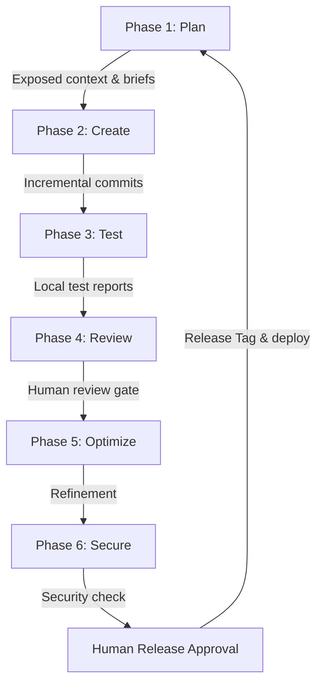
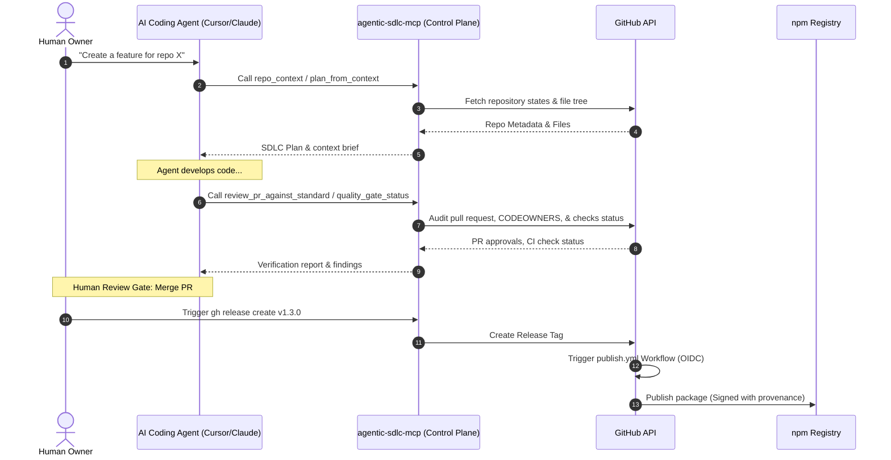

<p align="center">
  
</p>

<h1 align="center">Agentic SDLC Control Plane (agentic-sdlc-mcp)</h1>

<p align="center">
  <b>Expose professional, structured SDLC workflows as MCP tools to guide AI coding agents (Claude, Cursor, etc.) through safe, auditable development lifecycles.</b>
</p>

<p align="center">
  <a href="https://www.npmjs.com/package/agentic-sdlc-mcp"></a>
  <a href="https://github.com/SakuraCianna/agentic-sdlc-mcp/actions/workflows/ci.yml"></a>
  <a href="https://www.npmjs.com/package/agentic-sdlc-mcp"></a>
  <a href="https://github.com/SakuraCianna/agentic-sdlc-mcp/blob/main/LICENSE"></a>
  <a href="https://modelcontextprotocol.io"></a>
</p>

---

## 💡 What Is This?

Traditional AI agents write code but often lack the context of software engineering discipline. They might force-push, bypass reviews, fail to run CI, leak secrets, or skip writing test cases.

`agentic-sdlc-mcp` is an **SDLC orchestration layer and control plane** built on the **Model Context Protocol (MCP)**. It wraps GitHub APIs into high-level, opinionated tools that enforce traceability, human-in-the-loop gates, quality thresholds, and security checks for AI coding agents.

### The Agentic SDLC Loop


---

## 🛠️ Tools Categorization

Instead of exposing raw API endpoints, this server provides **12 specialized tools** structured around the SDLC pipeline:

| Category | Tools | Description |
|---|---|---|
| **💡 Planning & Context** | [`repo_context`](#repo_context)<br>[`plan_from_context`](#plan_from_context)<br>[`prepare_work_item`](#prepare_work_item) | Understand the codebase, structure phase-by-phase plans, and generate agent briefs. |
| **🚀 Execution** | [`create_issue_set`](#create_issue_set) | Batch-create GitHub issues mapping directly to the SDLC plan. |
| **🔍 Review & Verification** | [`quality_gate_status`](#quality_gate_status)<br>[`create_pr_summary`](#create_pr_summary)<br>[`review_pr_against_standard`](#review_pr_against_standard) | Audit CI checks, generate structured PR summaries, and review code against SDLC standard levels. |
| **🛡️ Governance & Security** | [`branch_protection_status`](#branch_protection_status)<br>[`workflow_permissions_audit`](#workflow_permissions_audit)<br>[`security_triage`](#security_triage)<br>[`release_readiness_check`](#release_readiness_check) | Query branch rule enforcement, audit Actions workflow permissions, triage vulnerabilities, and perform pre-release checks. |
| **🤝 Handoff & Continuity** | [`agent_handoff_packet`](#agent_handoff_packet) | Compile a packet so other agents can seamlessly take over the work. |

---

## 🗺️ System Architecture


---

## 📋 Prerequisites

Before running the server, ensure you have:
1. **Node.js >= 24** installed on your system.
2. **GitHub Personal Access Token (PAT)**:
   * **Scopes required**:
     * `repo` (Full control of private/public repositories, issues, PRs, and checks).
     * `security_events` (To query Code Scanning and Dependabot alerts).
     * Note: Make sure to verify token permissions against [GitHub REST API Documentation](https://docs.github.com/en/rest) if security endpoints fail.

---

## ⚡ Quick Start

### 1. Instant Run via npx (Recommended)
You do not need to download or clone the repository. Run the server directly inside your MCP client environment:
```bash
npx -y agentic-sdlc-mcp
```

### 2. Global Installation
Or install the package globally on your system:
```bash
npm install -g agentic-sdlc-mcp
# Start using the global command
agentic-sdlc-mcp
```

### 3. Local Development (From Source)
If you want to run or extend the server locally from the source code:
```bash
git clone https://github.com/SakuraCianna/agentic-sdlc-mcp.git
cd agentic-sdlc-mcp
npm install
npm run build
node dist/index.js
```

---

## ✅ Generic AI Coding Agent Smoke Test

If you need to verify this MCP server in any MCP-capable AI coding agent, follow the client-neutral guide in [`docs/ai-coding-agent-smoke-test.md`](docs/ai-coding-agent-smoke-test.md). It covers the minimum configuration, repository fallback behavior, `repo_context` read-only validation, and `create_issue_set` dry-run preview without creating GitHub issues.

---

## ⚙️ MCP Client Configuration

Add this server configuration to your MCP client setting files (e.g., `claude_desktop_config.json`, Cursor, or Windsurf settings):

### Claude Desktop / Cursor / Windsurf (Using npm package)
```json
{
  "mcpServers": {
    "agentic-sdlc": {
      "command": "npx",
      "args": ["-y", "agentic-sdlc-mcp"],
      "env": {
        "GITHUB_TOKEN": "REPLACE_WITH_GITHUB_TOKEN",
        "GITHUB_OWNER": "your-github-username-or-org",
        "GITHUB_REPO": "your-target-repository"
      }
    }
  }
}
```

### 🔑 Global Configuration & Interactive Setup (Persistent)

In addition to specifying environment variables in your MCP client configurations, you can configure your GitHub credentials globally using an interactive terminal questionnaire. The settings will be saved to `~/.agentic-sdlc-mcp.json` under your home directory and automatically loaded in subsequent runs.

#### 1. Configure via CLI
Run the configuration command:
```bash
npx agentic-sdlc-mcp configure
```
This guides you through configuring:
* `GITHUB_TOKEN` (Primary token; [generate classic token here](https://github.com/settings/tokens) with `repo` and `read:org` scopes)
* `GITHUB_OWNER` (Default repository owner name, optional)
* `GITHUB_REPO` (Default repository name, optional)

#### 2. Automatic Setup Prompts (TTY)
If you run `npx -y agentic-sdlc-mcp` directly without a configured `GITHUB_TOKEN`, the tool detects if it is in an interactive environment (TTY) and automatically launches the prompt flow. If it runs non-interactively (e.g. launched by Claude Desktop in the background), it exits gracefully with clear setup instructions.

#### 3. Global Environment Variables (Fallback)
You can still define environment variables directly in your terminal shell (`PowerShell` for Windows or `bash` for macOS/Linux):
```powershell
# Windows PowerShell
$env:GITHUB_TOKEN = "REPLACE_WITH_GITHUB_TOKEN"
$env:GITHUB_OWNER = "your-org"
$env:GITHUB_REPO  = "your-repo"
```

---

## 🎯 Typical Scenarios & Best Practices

AI agents should not run commands blindly or write code without structure. This control plane enforces software engineering discipline. Below are the recommended agent-collaboration patterns:

### Scenario 1: Bootstrapping a Feature / Fix
When an agent starts a task, it must follow this checklist to prevent "blind coding":
1. **Gather Context**: Call [`repo_context`](#repo_context) to check current issues, PRs, and branch states.
2. **Design a Plan**: Call [`plan_from_context`](#plan_from_context) with the task goal. This will outline structured issues corresponding to SDLC phases (Plan, Create, Test, Review, Optimize, Secure).
3. **Write Issues**: Call [`create_issue_set`](#create_issue_set) with `dryRun: false` to publish the checklist directly to GitHub.
4. **Acquire Work Brief**: Call [`prepare_work_item`](#prepare_work_item) on the active issue to retrieve precise guidelines, scope definitions, and related files.

### Scenario 2: Guarding the Pull Request Gate
Before submitting a PR for human review, the agent must verify its own quality:
1. **Generate PR Summary**: Call [`create_pr_summary`](#create_pr_summary) to auto-generate structured, professional release notes and file diff changes.
2. **Audit CI Status**: Call [`quality_gate_status`](#quality_gate_status) to ensure all GitHub Actions tests and linting check runs are passing green.
3. **Execute Static Audit**: Call [`review_pr_against_standard`](#review_pr_against_standard) with `standard: "strict"` or `"security-focused"` to scan diffs for key leaks, verify `.env` safety, and ensure `.github/CODEOWNERS` reviewers are correctly assigned.

### Scenario 3: Release Readiness Check
When preparation is complete and a release is requested:
1. **Vulnerability Check**: Call [`security_triage`](#security_triage) to audit Code Scanning (SAST), Dependabot, and Secret Scanning. Ensure no critical alerts block the release.
2. **Release Readiness**: Call [`release_readiness_check`](#release_readiness_check) to generate a rollback plan template, verify there are no open release-blocking issues, and ensure CHANGELOG.md is up to date.
3. **Handoff**: If transferring deployment duties to another agent, call [`agent_handoff_packet`](#agent_handoff_packet) to pass along the complete audit log.

---

## 📖 Tools Reference

Detailed specifications of the exposed MCP tools.

### `repo_context`
Reads repository metadata, README, package.json, open issues, and open PRs. Optionally acts as a fuller "repository briefing packet" -- detected package manager, tech stack, common verification scripts, workflow file names, lightweight governance signals, and agent instruction file summaries (e.g. `AGENTS.md`, `CLAUDE.md`). Use this at the start of any workflow to orient the agent.
When requested, the bounded `readmeSummary` and `packageJsonSummary` values are also returned in `structuredContent`, so agents do not need to recover them from the Markdown response.
* **Arguments:**
  * `owner` (string, optional): GitHub owner.
  * `repo` (string, optional): GitHub repo.
  * `includeReadme` (boolean, default: `true`): Include a truncated README summary.
  * `includePackageJson` (boolean, default: `false`): Include package.json summary, detected package manager (npm/pnpm/yarn/bun), tech stack, and common scripts (build/test/typecheck/lint/smoke/...).
  * `includeWorkflows` (boolean, default: `false`): Include `.github/workflows/*.yml` file names (names only -- use `workflow_permissions_audit` for permission contents).
  * `includeAgentInstructions` (boolean, default: `false`): Include summaries of agent instruction files found at the repo root (`AGENTS.md`, `CLAUDE.md`).
  * `includeGovernance` (boolean, default: `false`): Include whether a CODEOWNERS file exists (for full branch protection details, use `branch_protection_status`).
  * `includeOpenIssues` / `includeOpenPRs` (boolean, default: `false`): Include recent open issues/PRs.
  * `issueLimit` / `prLimit` (number, default: `20`, max: `100`): Cap how many issues/PRs are fetched.
  * `maxReadmeChars` (number, default: `3000`): Max README characters before truncation.
  * `maxInstructionChars` (number, default: `1000`): Max characters per agent instruction file summary before truncation.

### `plan_from_context`
Generates a structured, phase-by-phase SDLC plan matching the standard milestones, tailored to a `workType`. Each work type gets a materially different plan -- e.g. `docs` never defaults to requiring code unit tests, `bugfix` always includes repro + regression tests, `security` always includes a threat model and least-privilege review, and `release`/`infra` always include changelog/rollback and workflow-permission checks respectively.
The response includes 3-5 structured `issueDrafts` whose titles, Markdown bodies, confirmed repository labels, SDLC phases, acceptance criteria, risk levels, and source goal can be passed directly to `create_issue_set`.
* **Arguments:**
  * `owner` / `repo` (string, optional): Repo coordinates.
  * `goal` (string, required): The target feature or fix description.
  * `workType` (string, optional): One of `docs` / `feature` / `bugfix` / `refactor` / `security` / `release` / `infra`. If omitted, it is inferred from `goal` + `acceptanceCriteria` via a conservative keyword heuristic -- the response's `confidence` (`high`/`medium`/`low`) and `needsClarification` fields tell you whether to trust the guess or pass `workType` explicitly.
  * `constraints` (string[], optional): Technical or business constraints.
  * `acceptanceCriteria` (string[], optional): Explicit acceptance criteria (also used for workType inference).

### `create_issue_set`
Previews or batch-creates GitHub issues mapping to the generated plan. Dry-run responses include the target repository, final titles, labels, body summaries, and human-review warnings without calling a GitHub write API. Live batches retain successful issue numbers and URLs while reporting safe per-item failure reasons, so one rejected issue does not hide earlier successes or stop later attempts.
* **Arguments:**
  * `owner` / `repo` (string, optional): Repo coordinates.
  * `issues` (array of objects, required): Structured list of issues to create (title, body, labels, and optional assignees). Accepts `plan_from_context.issueDrafts` directly.
  * `dryRun` (boolean, default: `true`): If `true`, previews the list without writing to GitHub.

### `prepare_work_item`
Generates an agent-ready brief for a specific issue containing goals, non-goals, and technical risks.
* **Arguments:**
  * `owner` / `repo` (string, optional): Repo coordinates.
  * `issueNumber` (number, required): The target issue ID.
  * `includeRelatedFiles` (boolean, default: `false`): Heuristically extract mentioned file paths.
  * `includeRecentPRs` (boolean, default: `false`): Scan up to 5 merged PRs that touched these paths.

### `quality_gate_status`
Audits the check-runs (CI status, build status, linting status) for a given PR or git ref.
* **Arguments:**
  * `owner` / `repo` (string, optional): Repo coordinates.
  * `pullNumber` (number, optional): Query checks by PR number.
  * `ref` (string, optional): Query checks by branch, tag, or SHA.

### `create_pr_summary`
Generates a structured pull request description and changelog draft.
* **Arguments:**
  * `owner` / `repo` (string, optional): Repo coordinates.
  * `pullNumber` (number, required): The pull request ID.

### `review_pr_against_standard`
Reviews pull request code changes against SDLC governance levels (`basic` / `strict` / `security-focused`).
* **Arguments:**
  * `owner` / `repo` (string, optional): Repo coordinates.
  * `pullNumber` (number, required): The pull request ID.
  * `standard` (string, default: `"basic"`): Standard level.
  * `checkOwnership` (boolean, default: `true`): Validates file ownership changes against `.github/CODEOWNERS` and flags unassigned reviewers.

### `security_triage`
Retrieves and triages Code Scanning, Dependabot, and Secret Scanning alerts.
* **Arguments:**
  * `owner` / `repo` (string, optional): Repo coordinates.

### `release_readiness_check`
Assesses pre-release health (tests, open bugs, changelogs) and generates rollback instructions.
* **Arguments:**
  * `owner` / `repo` (string, optional): Repo coordinates.
  * `headRef` (string, optional): Target release branch/tag.

### `branch_protection_status`
Queries classic branch protection and repository rulesets for required reviews, status checks, and push limits.
* **Arguments:**
  * `owner` / `repo` (string, optional): Repo coordinates.
  * `branch` (string, optional): Target branch. Defaults to default branch.

### `workflow_permissions_audit`
Scans `.github/workflows/*.yml` files for `permissions` blocks and flags over-permissioned tokens.
* **Arguments:**
  * `owner` / `repo` (string, optional): Repo coordinates.
  * `ref` (string, optional): Git ref. Defaults to default branch.

### `agent_handoff_packet`
Compiles current issue context, completed work, and remaining tasks into a compact prompt packet for the next agent.
* **Arguments:**
  * `owner` / `repo` (string, optional): Repo coordinates.
  * `issueNumber` (number, required): Active issue ID.

---

## 📚 Resources Reference

The server exposes read-only static resources under the `sdlc://` schema for quick agent guidance:

| Resource URI | Description |
|---|---|
| `sdlc://standards/agentic-sdlc` | Full Markdown specification of the Agentic SDLC Standard. |
| `sdlc://templates/issue` | Markdown template for creating structured GitHub issues. |
| `sdlc://templates/pr-summary` | Markdown template for PR descriptions and changelogs. |
| `sdlc://templates/release-readiness` | Checklist for pre-release audits. |
| `sdlc://templates/handoff` | Prompt packet template for agent handoffs. |

---

## 🔒 Safety Defaults & `dryRun` Model

To prevent AI coding agents from performing destructive or unintended actions on production repositories, this control plane enforces:

* **Preview by Default (`dryRun: true`)**: All tools that write data (like `create_issue_set`) run in preview mode by default. Writing requires explicitly passing `dryRun: false`.
* **Reviewable Batch Results**: Issue previews expose the exact target repository and warnings before a write. Live batches preserve both successful results and safe failure details instead of concealing partial completion.
* **Zero Self-Merge Policy**: No tools exist to auto-merge pull requests. Human approval is required on all merge gates.
* **Access Restraints**: The server does not support force-pushing or deleting branch rules.
* **CODEOWNERS Enforced Review**: Special paths (such as workflows under `.github/` and core files under `src/`) require owner approvals.

---

## 📦 Developer Guide & npm Publishing

### Development Scripts
* `npm run typecheck`: Runs TypeScript compiler type checking.
* `npm run build`: Compiles TS files to the `dist/` directory.
* `npm run test`: Executes the full unit test suite.
* `npm run smoke`: Verifies registration and loading without external credentials.

### OIDC Trusted Publishing (For Maintainers)
This package is securely published to npm via GitHub Actions using **Trusted Publishing (OIDC)**, eliminating the need to store static `NPM_TOKEN` secrets in the repository. Publishing is triggered by creating a GitHub Release or manually running the Action.

---

## 📄 License

Exposed under the [MIT License](LICENSE).
