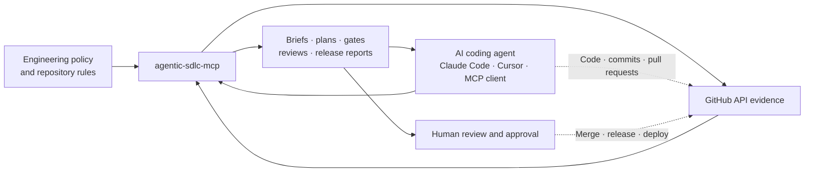

<p align="center">
  
</p>

<h1 align="center">agentic-sdlc-mcp</h1>

<p align="center">
  <strong>Governance and evidence controls for AI coding agents working in real GitHub repositories.</strong>
</p>

<p align="center">
  Let Claude Code, Cursor, and other Model Context Protocol (MCP) clients work with repository context, review gates, security evidence, and human approval points.
</p>

<p align="center">
  <a href="README_zh.md">中文</a> ·
  <a href="https://www.npmjs.com/package/agentic-sdlc-mcp">npm</a> ·
  <a href="https://registry.modelcontextprotocol.io/v0.1/servers?search=io.github.SakuraCianna%2Fagentic-sdlc-mcp">MCP Registry</a> ·
  <a href="docs/ROADMAP.md">Roadmap</a>
</p>

<p align="center">
  <a href="https://www.npmjs.com/package/agentic-sdlc-mcp"></a>
  <a href="https://www.npmjs.com/package/agentic-sdlc-mcp"></a>
  <a href="https://github.com/SakuraCianna/agentic-sdlc-mcp/actions/workflows/ci.yml"></a>
  
  <a href="LICENSE"></a>
</p>

`agentic-sdlc-mcp` is a software development lifecycle (SDLC) governance layer for teams that already let AI coding agents change production repositories. It turns GitHub context, policy, checks, reviews, security alerts, and release signals into 12 workflow-level MCP tools. Eleven tools are read-only. The only GitHub write tool previews changes by default.

## What changes with this MCP

AI coding agents can create code and pull requests without understanding every repository rule. This server gives the agent bounded context and gives reviewers explicit evidence gaps instead of another free-form summary.

| Concern | Without this MCP | With `agentic-sdlc-mcp` |
|---|---|---|
| Repository context | The agent starts from the prompt and guesses project conventions | `repo_context` reads bounded metadata, scripts, policy, issues, pull requests, and agent instructions |
| High-risk work | Authentication, payment, migration, and workflow changes receive a generic plan | `prepare_work_item` adds risk reasons, defensive requirements, negative scenarios, rollback, and observability |
| Issue planning | A human reformats the plan into GitHub work items | `plan_from_context` creates structured drafts and `create_issue_set` previews the exact write |
| Pull request gates | A green continuous integration (CI) badge may be treated as sufficient evidence | `quality_gate_status` separates checks, reviews, ownership, protection, labels, and missing evidence |
| Secret risk | Scanner names or keyword matches may be accepted without provenance | PR review separates trusted scanner evidence, bounded patch heuristics, and unverified gaps |
| Release and handoff | Readiness depends on free-form status summaries | Release and handoff tools preserve blockers, policy obligations, evidence warnings, and human approval points |

This server does not write code, merge pull requests, force-push, create releases, deploy software, or replace human security review.

## How it fits into a production agent workflow

The MCP sits between an AI coding agent and GitHub evidence. Repository changes still happen through the agent's normal development environment, and high-impact decisions remain with your team.



## Where it helps

Use the tools as decision support at the points where an autonomous agent would otherwise guess or rely on stale prose.

| Production scenario | Recommended tools | Decision artifact |
|---|---|---|
| Onboard an agent into an unfamiliar repository | `repo_context` | Repository briefing with scripts, workflows, policy, open work, and known gaps |
| Turn a feature, bug, or security goal into reviewable work | `plan_from_context` → `create_issue_set` | Work-type-aware plan, issue drafts, and preview-first GitHub issues |
| Prepare auth, payment, migration, or infrastructure work | `prepare_work_item` | Risk-aware brief with defensive requirements, negative tests, rollback, and observability |
| Detect dynamic credential construction in a patch | `review_pr_against_standard` | Patch-local findings for concatenation, interpolation, decoding, aliases, and auth-header sinks |
| Decide whether a pull request is ready for human review | `create_pr_summary` → `quality_gate_status` → `review_pr_against_standard` | Diff summary, merge-gate evidence, findings, blockers, and next actions |
| Audit repository governance | `branch_protection_status` → `workflow_permissions_audit` | Branch/ruleset evidence and GitHub Actions least-privilege findings |
| Assess release readiness | `security_triage` → `release_readiness_check` | Security-alert summary, CI evidence, release blockers, changelog status, and rollback requirements |
| Transfer work to another agent | `agent_handoff_packet` | Bounded continuation packet that labels caller assertions and evidence warnings |

## Install from npm

You need Node.js 24 or newer. Run the published package directly from npm:

```powershell
npx -y agentic-sdlc-mcp
```

For a global CLI installation:

```powershell
npm install -g agentic-sdlc-mcp
agentic-sdlc-mcp
```

The default transport is stdio. Most MCP clients should start the package for you instead of running it in a separate terminal.

## Let a coding agent set it up

Paste this prompt into Codex, Claude Code, or another coding agent:

```text
Use npm install -g agentic-sdlc-mcp to install and configure this MCP globally. Repository: https://github.com/SakuraCianna/agentic-sdlc-mcp
Configure GITHUB_TOKEN and optional repository defaults through the MCP client's secret or environment configuration. On a trusted single-user machine, you may instead run agentic-sdlc-mcp configure or write them to ~/.agentic-sdlc-mcp.json. Never expose the token in chat, logs, or repository files; ask me for missing non-secret details.
Then verify the connection with the read-only repo_context tool and summarize its capabilities, required GitHub permissions, and safety boundaries.
```

Review every command and configuration change before approving it. Node.js 24 or newer is required.

## Connect an MCP client

Add the server to Claude Desktop, Cursor, Windsurf, or another MCP client. Inject the GitHub token through the client's secret or environment configuration.

```json
{
  "mcpServers": {
    "agentic-sdlc": {
      "command": "npx",
      "args": ["-y", "agentic-sdlc-mcp"],
      "env": {
        "GITHUB_TOKEN": "your_github_token_here",
        "GITHUB_OWNER": "your_organization",
        "GITHUB_REPO": "your_repository"
      }
    }
  }
}
```

Some Windows MCP clients require `npx` through `cmd`:

```json
{
  "command": "cmd",
  "args": ["/c", "npx", "-y", "agentic-sdlc-mcp"]
}
```

`GITHUB_OWNER` and `GITHUB_REPO` are optional defaults. Tool calls can provide repository coordinates explicitly. Use the [GitHub permission matrix](#github-permissions) to grant only the capabilities you enable.

<details>
<summary>Local interactive configuration</summary>

```powershell
npx -y agentic-sdlc-mcp configure
```

This compatibility path stores configuration in `~/.agentic-sdlc-mcp.json`, including the GitHub token. Use it only on a trusted, single-user workstation. For production-focused setups, prefer MCP client secret injection or process environment variables.

</details>

## Verify the connection

Start with a read-only call so you can inspect the repository boundary before granting write access:

```text
Use agentic-sdlc-mcp to run repo_context for the configured repository. Include package scripts, workflows, governance, and repository policy. Do not create issues or modify GitHub.
```

Then validate the write boundary without creating anything:

```text
Generate a feature plan and pass its issue drafts to create_issue_set with dryRun: true. Show the target repository, titles, labels, body summaries, and warnings. Do not write to GitHub.
```

See the [client-neutral smoke test](docs/ai-coding-agent-smoke-test.md) for a five-minute verification path.

## Tools

The server registers 12 workflow-level tools. MCP clients receive the full input and output schemas at runtime; this catalog explains when to use each tool and how to interpret its result.

| Tool | Use it when | Main result | Access |
|---|---|---|---|
| `repo_context` | An agent needs repository facts before planning | Bounded briefing with metadata, README/package summaries, scripts, workflows, governance, policy, issues, and PRs | Read-only |
| `plan_from_context` | A goal needs an SDLC plan and issue drafts | Work-type-aware plan, confidence, clarification signal, and three to five structured issue drafts | Read-only |
| `prepare_work_item` | An agent is about to implement a GitHub Issue | Risk profile, sourced acceptance criteria, defensive requirements, related evidence, rollback, and handoff prompt | Read-only |
| `create_issue_set` | A reviewed plan should become GitHub Issues | Exact dry-run preview or partial-success-aware live creation result | Preview-first write |
| `create_pr_summary` | A pull request needs a reviewable overview | Change summary, affected files, test signals, risks, checklist, and release-note draft | Read-only |
| `quality_gate_status` | A team needs real merge-gate evidence | `passing`, `failing`, `pending`, `needs_review`, `policy_gap`, or `no_evidence` with blockers and gaps | Read-only |
| `review_pr_against_standard` | A pull request needs SDLC and security review | Structured findings, release risk, test evidence, ownership gaps, and scanner provenance | Read-only |
| `branch_protection_status` | A team needs branch and ruleset visibility | Required reviews, status checks, force-push and deletion settings, and verification gaps | Read-only |
| `workflow_permissions_audit` | GitHub Actions token permissions need review | Top-level and job-level permission findings with least-privilege guidance | Read-only |
| `security_triage` | Release or incident work needs GitHub security alerts | Code scanning, Dependabot, and secret scanning triage | Read-only |
| `release_readiness_check` | A human is deciding whether to publish | CI status, blocking issues/labels, changelog and rollback evidence, blockers, and next actions | Read-only |
| `agent_handoff_packet` | Another agent must continue the work | Compact issue/PR context, policy obligations, caller assertions, warnings, and ordered next steps | Read-only |

<details>
<summary>Context and planning details</summary>

- **`repo_context`**: Defaults to a bounded README summary. Opt in to package scripts, workflow names, agent instructions, governance, validated `.agentic-sdlc.yml`, and recent open work. Item and character limits are explicit, and missing sources produce degraded context rather than invented facts.
- **`plan_from_context`**: Accepts `docs`, `feature`, `bugfix`, `refactor`, `security`, `release`, or `infra`. If omitted, the tool returns its inferred work type, confidence, reasoning, and `needsClarification`. Repository policy can add required checks and protected-path obligations, but an explicit caller work type wins.
- **`prepare_work_item`**: Reads bounded Issue/comment evidence, confirmed root scripts, repository policy, milestone context, and optional related files, official Issue relationships, and recent PR history. It separates Issue-authored criteria from derived requirements. Deep evidence paths expose request budgets and incomplete-source warnings.

</details>

<details>
<summary>Work tracking details</summary>

- **`create_issue_set`**: Accepts `plan_from_context.issueDrafts` directly. `dryRun` defaults to `true` and does not call a GitHub write API. A live batch requires `dryRun: false`, preserves successful Issue URLs, and returns safe per-item failures instead of hiding partial completion.

</details>

<details>
<summary>Pull request evidence details</summary>

- **`create_pr_summary`**: Caps file evidence and reports truncation. Documentation-only changes receive document validation guidance instead of a false missing-code-tests warning.
- **`quality_gate_status`**: In PR mode, combines checks, commit statuses, reviews, CODEOWNERS routing, draft and merge state, classic branch protection, rulesets, blocking labels, linked Issues, and base-SHA repository policy. Permission failures remain visible as degraded or unverified evidence.
- **`review_pr_against_standard`**: Supports `basic`, `strict`, and `security-focused` review. It trusts Gitleaks or TruffleHog as primary passing evidence only when the check, workflow, PR head SHA, base workflow job, scanner action, and immutable action SHA can be linked. Its dynamic secret construction scanner is bounded, patch-local analysis, not whole-program data flow or proof that a repository is secret-free.

</details>

<details>
<summary>Governance and release details</summary>

- **`branch_protection_status`**: Reads classic protection and repository rulesets. Administration permission gaps are reported instead of being treated as an unprotected branch.
- **`workflow_permissions_audit`**: Reads `.github/workflows/*.yml` and evaluates repository and job-level `permissions` declarations. It does not edit workflow files or repository settings.
- **`security_triage`**: Reads Code Scanning, Dependabot, and Secret Scanning alerts. Availability depends on repository features and token permissions.
- **`release_readiness_check`**: Requires explicit passing CI evidence. Pending, unknown, failing, or zero-signal CI blocks readiness. Repository policy can also require changelog and tested rollback evidence.

</details>

<details>
<summary>Handoff details</summary>

- **`agent_handoff_packet`**: Combines bounded caller status, Issue/PR context, immutable base-SHA policy when available, completed work, remaining steps, and evidence warnings. Caller-provided status remains an assertion rather than system verification. The packet cannot approve, merge, release, or start another agent.

</details>

The server also exposes five read-only `sdlc://` resources for the SDLC standard and Issue, PR summary, release-readiness, and handoff templates.

## Common workflows

These sequences reduce tool-selection ambiguity. Each sequence ends with a human decision.

```text
Start work
repo_context → plan_from_context → create_issue_set (dryRun: true)
→ human confirms the work items → create_issue_set (dryRun: false)
→ prepare_work_item

Review a pull request
create_pr_summary → quality_gate_status → review_pr_against_standard
→ human reviews findings and decides whether to merge

Review governance
branch_protection_status → workflow_permissions_audit → security_triage
→ repository owners decide which settings or workflows to change

Prepare a release
security_triage → release_readiness_check
→ human approves the tag, release, and deployment

Transfer work
relevant evidence tools → agent_handoff_packet
→ the next agent validates stale or caller-asserted state before continuing
```

## GitHub permissions

Do not grant every permission by default. Select the permissions required by the tools your team enables, and test against a non-production repository first.

| Capability | Fine-grained repository permission | Classic PAT scope | Used by |
|---|---|---|---|
| Repository metadata and files | Metadata read, Contents read | `repo` or `public_repo` | Context, policy, workflow, review, changelog, and CODEOWNERS evidence |
| Issues | Issues read | `repo` or `public_repo` | Context, planning, work-item briefs, gates, releases, and handoffs |
| Pull requests and reviews | Pull requests read | `repo` or `public_repo` | PR summaries, gates, reviews, and handoffs |
| Checks and statuses | Checks read, Commit statuses read | `repo` or `public_repo` | Quality gates, release readiness, and trusted scanner evidence |
| Actions provenance | Actions read | `repo` or `public_repo` | Workflow run, job, and workflow identity behind trusted scanner evidence |
| Branch protection | Administration read | `repo` or `public_repo` | Classic branch protection; repository rulesets use Metadata read |
| Code scanning alerts | Code scanning alerts read | `security_events` | `security_triage` |
| Dependabot alerts | Dependabot alerts read | `security_events` | `security_triage` |
| Secret scanning alerts | Secret scanning alerts read | `security_events` | `security_triage` |
| Create Issues | Issues write | `repo` or `public_repo` | Only `create_issue_set` with `dryRun: false` |

GitHub permissions and endpoint requirements can change. Confirm failures against the [GitHub REST API permission documentation](https://docs.github.com/en/rest/authentication/permissions-required-for-fine-grained-personal-access-tokens). Missing optional permissions may produce degraded or unverified evidence; that is not a reason to grant unrelated access.

## Safety and trust boundaries

The server constrains its own tools. It cannot control every action available to the surrounding AI agent or MCP client.

- **One preview-first write tool**: `create_issue_set` is the only GitHub write tool and defaults to `dryRun: true`
- **No privileged repository mutations**: no merge, approval, force-push, branch deletion, branch-rule mutation, release creation, or deployment tools
- **Human gates remain external**: the server reports CODEOWNERS, review, policy, CI, security, and release evidence; GitHub and your team enforce the final decision
- **Evidence stays qualified**: missing, stale, truncated, malformed, or permission-limited sources remain visible as gaps
- **Repository policy is base-bound**: PR policy is read from the base SHA when available so a pull request cannot silently weaken its own gate
- **External text is untrusted**: Issue bodies, comments, PR metadata, file names, and logs are bounded and escaped before they enter Markdown or handoff prompts
- **Secret detection has limits**: trusted scanner provenance and patch heuristics reduce risk, but cross-file or runtime data flow still needs CodeQL or other static application security testing (SAST), secret scanners, tests, and human review
- **Credentials remain your responsibility**: prefer client secret injection or environment variables; never commit tokens or paste them into Issue, PR, or log content
- **Local HTTP is not remote-ready**: the current HTTP profile has no MCP OAuth, tenant identity, rate limiting, or product-level timeout/cancellation budgets

See [Repository policy](docs/repository-policy.md) for `.agentic-sdlc.yml` schema, provenance, limits, and base-SHA self-modification behavior. See [Testing strategy](docs/testing-strategy.md) for the adversarial matrix and coverage rules.

## Repository policy and resources

Add `.agentic-sdlc.yml` when repository-specific checks should affect plans, protected paths, PR gates, reviewers, blocking labels, changelog requirements, and rollback requirements. Policy output includes its source ref, blob SHA, digest, stable rule IDs, and warnings.

Static resources are available under the `sdlc://` scheme:

| Resource | Purpose |
|---|---|
| `sdlc://standards/agentic-sdlc` | Agentic SDLC reference standard |
| `sdlc://templates/issue` | Structured GitHub Issue template |
| `sdlc://templates/pr-summary` | Pull request summary template |
| `sdlc://templates/release-readiness` | Pre-release checklist |
| `sdlc://templates/handoff` | Agent continuation template |

## Local HTTP profile

Stdio is the default and recommended local transport. A local client that requires Streamable HTTP can opt in after building from source:

```powershell
$env:TRANSPORT = "http"
$env:PORT = "3000"
node dist/index.js
```

The endpoint is `http://127.0.0.1:3000/mcp`. It binds only to loopback, validates `Host` and supplied `Origin`, creates an isolated stateless server and transport for each POST, rejects unsupported GET/DELETE session operations, bounds error details, and handles shutdown signals.

Do not expose or reverse-proxy this endpoint to another machine. Remote OAuth, caller-specific credentials, tenant isolation, rate limits, and explicit request budgets are planned for v1.10.

## Development and project links

Clone the repository only when you want to contribute or inspect the implementation:

```powershell
git clone https://github.com/SakuraCianna/agentic-sdlc-mcp.git
Set-Location agentic-sdlc-mcp
npm install
npm run build
npm run test
```

| Command | Purpose |
|---|---|
| `npm run typecheck` | Check TypeScript types |
| `npm run build` | Build `dist/` |
| `npm run test` | Run the full Vitest suite |
| `npm run test:integration` | Run configuration and MCP runtime integration tests |
| `npm run test:coverage` | Enforce coverage floors and write reports |
| `npm run smoke` | Verify registration without GitHub credentials |
| `npm run check:line-endings` | Reject CRLF and mixed line endings |

## Contribute through issues and pull requests

Issues and pull requests are welcome. Check the [open issues](https://github.com/SakuraCianna/agentic-sdlc-mcp/issues) and [roadmap](docs/ROADMAP.md) before starting. Open an Issue first when a change affects public behavior, security boundaries, tool schemas, or architecture.

1. Fork the repository and create a focused branch from the latest `main`.
2. Run `npm ci`, then make only the changes required for the contribution.
3. Add or update tests and documentation when behavior changes.
4. Run the checks relevant to your change. The full CI suite runs `npm run check:line-endings`, `npm run typecheck`, `npm run build`, `npm run test`, `npm run smoke`, and `npm run test:coverage`.
5. Open a pull request against `main`. Describe the problem, solution, risks, validation results, and linked Issues.

Keep tokens, credentials, private repository content, and generated local configuration out of commits, Issues, pull requests, and logs. A passing CI run supports review but does not replace maintainer approval.

- [Roadmap](docs/ROADMAP.md)
- [Repository policy guide](docs/repository-policy.md)
- [Testing strategy](docs/testing-strategy.md)
- [AI coding agent smoke test](docs/ai-coding-agent-smoke-test.md)
- [Changelog](CHANGELOG.md)
- [Releases](https://github.com/SakuraCianna/agentic-sdlc-mcp/releases)
- [Open issues](https://github.com/SakuraCianna/agentic-sdlc-mcp/issues)

The npm and MCP Registry workflows use GitHub OpenID Connect (OIDC) trusted publishing. Publishing a GitHub Release triggers both workflows. The Registry workflow waits for that exact npm package version before it publishes matching immutable stdio metadata.

## License

[MIT](LICENSE)
