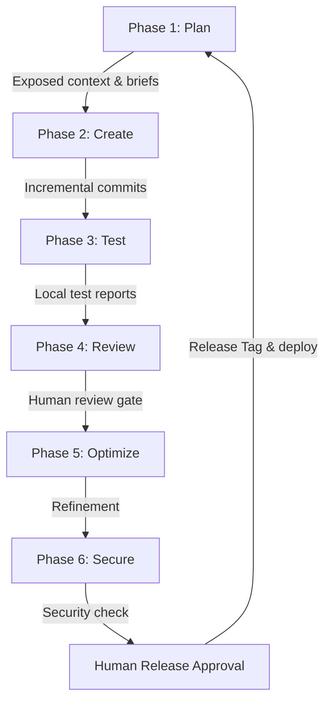
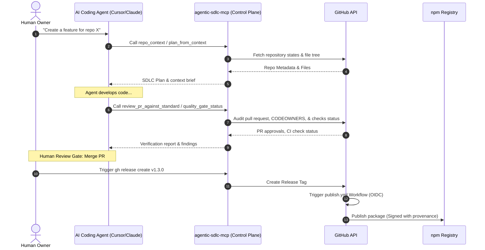

<p align="center">
  
</p>

<h1 align="center">Agentic SDLC Control Plane (agentic-sdlc-mcp)</h1>

<p align="center">
  <b>Expose professional, structured SDLC workflows as MCP tools to guide AI coding agents (Claude, Cursor, etc.) through safe, auditable development lifecycles.</b>
</p>

<p align="center">
  <a href="https://www.npmjs.com/package/agentic-sdlc-mcp"></a>
  <a href="https://github.com/SakuraCianna/agentic-sdlc-mcp/actions/workflows/ci.yml"></a>
  <a href="https://www.npmjs.com/package/agentic-sdlc-mcp"></a>
  <a href="https://github.com/SakuraCianna/agentic-sdlc-mcp/blob/main/LICENSE"></a>
  <a href="https://modelcontextprotocol.io"></a>
</p>

---

## 💡 What Is This?

Traditional AI agents write code but often lack the context of software engineering discipline. They might force-push, bypass reviews, fail to run CI, leak secrets, or skip writing test cases.

`agentic-sdlc-mcp` is an **SDLC orchestration layer and control plane** built on the **Model Context Protocol (MCP)**. It wraps GitHub APIs into high-level, opinionated tools that enforce traceability, human-in-the-loop gates, quality thresholds, and security checks for AI coding agents.

### The Agentic SDLC Loop


---

## 🛠️ Tools Categorization

Instead of exposing raw API endpoints, this server provides **12 specialized tools** structured around the SDLC pipeline:

| Category | Tools | Description |
|---|---|---|
| **💡 Planning & Context** | [`repo_context`](#repo_context)<br>[`plan_from_context`](#plan_from_context)<br>[`prepare_work_item`](#prepare_work_item) | Understand the codebase, structure phase-by-phase plans, and generate agent briefs. |
| **🚀 Execution** | [`create_issue_set`](#create_issue_set) | Batch-create GitHub issues mapping directly to the SDLC plan. |
| **🔍 Review & Verification** | [`quality_gate_status`](#quality_gate_status)<br>[`create_pr_summary`](#create_pr_summary)<br>[`review_pr_against_standard`](#review_pr_against_standard) | Audit CI checks, generate structured PR summaries, and review code against SDLC standard levels. |
| **🛡️ Governance & Security** | [`branch_protection_status`](#branch_protection_status)<br>[`workflow_permissions_audit`](#workflow_permissions_audit)<br>[`security_triage`](#security_triage)<br>[`release_readiness_check`](#release_readiness_check) | Query branch rule enforcement, audit Actions workflow permissions, triage vulnerabilities, and perform pre-release checks. |
| **🤝 Handoff & Continuity** | [`agent_handoff_packet`](#agent_handoff_packet) | Compile a packet so other agents can seamlessly take over the work. |

---

## 🗺️ System Architecture


---

## ⚡ Quick Start

### 1. Installation

Requires **Node.js >= 24**.

```bash
# Clone the repository
git clone https://github.com/SakuraCianna/agentic-sdlc-mcp.git
cd agentic-sdlc-mcp

# Install dependencies and build
npm install
npm run build
```

### 2. Configure Environment

Copy `.env.example` to `.env` and fill in your details:
```bash
cp .env.example .env
```
Key configuration values:
* `GITHUB_TOKEN`: Your GitHub Personal Access Token (PAT) with appropriate scopes.
* `GITHUB_OWNER` / `GITHUB_REPO`: Default target repository coordinates.

---

## ⚙️ MCP Client Configuration

Add this server to your client settings (`claude_desktop_config.json` or your Cursor settings page):

### Claude Desktop / Cursor
```json
{
  "mcpServers": {
    "agentic-sdlc": {
      "command": "node",
      "args": ["E:/CodeHome/agentic-sdlc-mcp/dist/index.js"],
      "env": {
        "GITHUB_TOKEN": "ghp_your_token",
        "GITHUB_OWNER": "your-org",
        "GITHUB_REPO": "your-repo"
      }
    }
  }
}
```

### Windsurf
```json
{
  "mcpServers": {
    "agentic-sdlc": {
      "command": "node",
      "args": ["E:/CodeHome/agentic-sdlc-mcp/dist/index.js"],
      "env": {
        "GITHUB_TOKEN": "ghp_your_token",
        "GITHUB_OWNER": "your-org",
        "GITHUB_REPO": "your-repo"
      }
    }
  }
}
```

---

## 📖 Tools Reference

Detailed specifications of the exposed MCP tools.

### `repo_context`
Reads repository metadata, README, package.json, open issues, and open PRs. Use this at the start of any workflow to orient the agent.
* **Arguments:**
  * `owner` (string, optional): GitHub owner.
  * `repo` (string, optional): GitHub repo.
  * `issueLimit` / `prLimit` (number, default: `20`, max: `100`): Cap how many issues/PRs are fetched.

### `plan_from_context`
Generates a structured, phase-by-phase SDLC plan matching the standard milestones.
* **Arguments:**
  * `owner` / `repo` (string, optional): Repo coordinates.
  * `goal` (string, required): The target feature or fix description.

### `create_issue_set`
Batch-creates GitHub issues mapping to the generated plan.
* **Arguments:**
  * `owner` / `repo` (string, optional): Repo coordinates.
  * `issues` (array of objects, required): Structured list of issues to create (title, body, labels).
  * `dryRun` (boolean, default: `true`): If `true`, previews the list without writing to GitHub.

### `prepare_work_item`
Generates an agent-ready brief for a specific issue containing goals, non-goals, and technical risks.
* **Arguments:**
  * `owner` / `repo` (string, optional): Repo coordinates.
  * `issueNumber` (number, required): The target issue ID.
  * `includeRelatedFiles` (boolean, default: `false`): Heuristically extract mentioned file paths.
  * `includeRecentPRs` (boolean, default: `false`): Scan up to 5 merged PRs that touched these paths.

### `quality_gate_status`
Audits the check-runs (CI status, build status, linting status) for a given PR or git ref.
* **Arguments:**
  * `owner` / `repo` (string, optional): Repo coordinates.
  * `pullNumber` (number, optional): Query checks by PR number.
  * `ref` (string, optional): Query checks by branch, tag, or SHA.

### `create_pr_summary`
Generates a structured pull request description and changelog draft.
* **Arguments:**
  * `owner` / `repo` (string, optional): Repo coordinates.
  * `pullNumber` (number, required): The pull request ID.

### `review_pr_against_standard`
Reviews pull request code changes against SDLC governance levels (`basic` / `strict` / `security-focused`).
* **Arguments:**
  * `owner` / `repo` (string, optional): Repo coordinates.
  * `pullNumber` (number, required): The pull request ID.
  * `standard` (string, default: `"basic"`): Standard level.
  * `checkOwnership` (boolean, default: `true`): Validates file ownership changes against `.github/CODEOWNERS` and flags unassigned reviewers.

### `security_triage`
Retrieves and triages Code Scanning, Dependabot, and Secret Scanning alerts.
* **Arguments:**
  * `owner` / `repo` (string, optional): Repo coordinates.

### `release_readiness_check`
Assesses pre-release health (tests, open bugs, changelogs) and generates rollback instructions.
* **Arguments:**
  * `owner` / `repo` (string, optional): Repo coordinates.
  * `headRef` (string, optional): Target release branch/tag.

### `branch_protection_status`
Queries classic branch protection and repository rulesets for required reviews, status checks, and push limits.
* **Arguments:**
  * `owner` / `repo` (string, optional): Repo coordinates.
  * `branch` (string, optional): Target branch. Defaults to default branch.

### `workflow_permissions_audit`
Scans `.github/workflows/*.yml` files for `permissions` blocks and flags over-permissioned tokens.
* **Arguments:**
  * `owner` / `repo` (string, optional): Repo coordinates.
  * `ref` (string, optional): Git ref. Defaults to default branch.

### `agent_handoff_packet`
Compiles current issue context, completed work, and remaining tasks into a compact prompt packet for the next agent.
* **Arguments:**
  * `owner` / `repo` (string, optional): Repo coordinates.
  * `issueNumber` (number, required): Active issue ID.

---

## 📚 Resources Reference

The server exposes read-only static resources under the `sdlc://` schema for quick agent guidance:

| Resource URI | Description |
|---|---|
| `sdlc://standards/agentic-sdlc` | Full Markdown specification of the Agentic SDLC Standard. |
| `sdlc://templates/issue` | Markdown template for creating structured GitHub issues. |
| `sdlc://templates/pr-summary` | Markdown template for PR descriptions and changelogs. |
| `sdlc://templates/release-readiness` | Checklist for pre-release audits. |
| `sdlc://templates/handoff` | Prompt packet template for agent handoffs. |

---

## 🔒 Safety Defaults & `dryRun` Model

To prevent AI coding agents from performing destructive or unintended actions on production repositories, this control plane enforces:

* **Preview by Default (`dryRun: true`)**: All tools that write data (like `create_issue_set`) run in preview mode by default. Writing requires explicitly passing `dryRun: false`.
* **Zero Self-Merge Policy**: No tools exist to auto-merge pull requests. Human approval is required on all merge gates.
* **Access Restraints**: The server does not support force-pushing or deleting branch rules.
* **CODEOWNERS Enforced Review**: Special paths (such as workflows under `.github/` and core files under `src/`) require owner approvals.

---

## 📦 Developer Guide & npm Publishing

### Development Scripts
* `npm run typecheck`: Runs TypeScript compiler type checking.
* `npm run build`: Compiles TS files to the `dist/` directory.
* `npm run test`: Executes the unit test suite (165 test cases).
* `npm run smoke`: Verifies registration and loading without external credentials.

### OIDC Trusted Publishing (For Maintainers)
This package is securely published to npm via GitHub Actions using **Trusted Publishing (OIDC)**, eliminating the need to store static `NPM_TOKEN` secrets in the repository. Publishing is triggered by creating a GitHub Release or manually running the Action.

---

## 📄 License

Exposed under the [MIT License](LICENSE).
