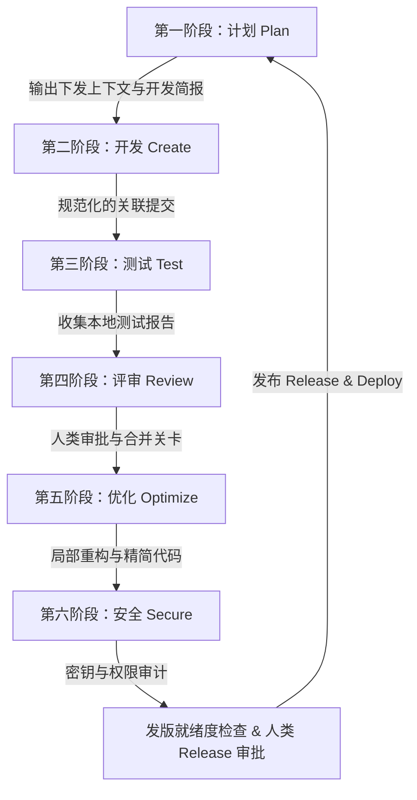
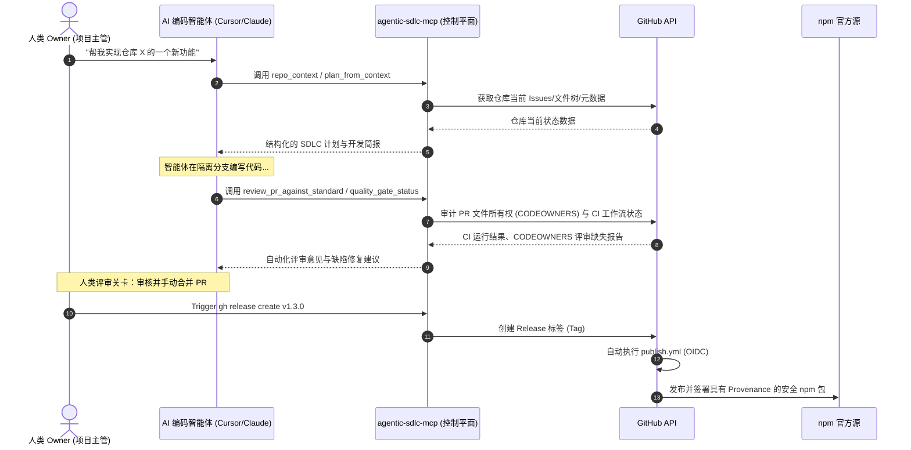

<p align="center">
  
</p>

<h1 align="center">Agentic SDLC Control Plane (agentic-sdlc-mcp)</h1>

<p align="center">
  <b>将专业、结构化的 SDLC 工作流封装为 MCP 工具，引导 AI 编码智能体（如 Claude、Cursor 等）在安全、可追溯且防失控的研生命周期中进行协作。</b>
</p>

<p align="center">
  <a href="https://www.npmjs.com/package/agentic-sdlc-mcp"></a>
  <a href="https://github.com/SakuraCianna/agentic-sdlc-mcp/actions/workflows/ci.yml"></a>
  <a href="https://www.npmjs.com/package/agentic-sdlc-mcp"></a>
  <a href="https://github.com/SakuraCianna/agentic-sdlc-mcp/blob/main/LICENSE"></a>
  <a href="https://modelcontextprotocol.io"></a>
</p>

---

## 💡 项目背景与核心理念

传统的 AI 智能体能够快速生成代码，但常常缺乏软件工程纪律与合规约束。它们可能会在没有测试的情况下直接强推主分支、绕过 PR 评审、无意中泄露密钥，或者未运行 CI 检查就合并代码。

`agentic-sdlc-mcp` 是基于 **Model Context Protocol (MCP)** 构建的 **SDLC 智能编排层与控制平面**。它将 GitHub API 提炼成高层次、富有软件工程纪律的工具，为 AI 编码智能体建立可追溯性、强制性的人类审批关卡、代码质量门禁以及安全性校验。

### 代理式 SDLC 研发闭环


---

## 🛠️ 工具能力分类

本项目并不是对 GitHub API 的简单扁平包装，而是围绕 SDLC 阶段构建的 **12 款专业工具**：

| 分类模块 | 包含工具 | 描述说明 |
|---|---|---|
| **💡 规划与上下文** | [`repo_context`](#repo_context)<br>[`plan_from_context`](#plan_from_context)<br>[`prepare_work_item`](#prepare_work_item) | 检索仓库现状、根据上下文自动拟定 SDLC 阶段计划，并生成可读的智能体开发简报。 |
| **🚀 任务拆解与写入** | [`create_issue_set`](#create_issue_set) | 依据 SDLC 计划在 GitHub 上批量创建对应的 Issues。 |
| **🔍 质量保障与评审** | [`quality_gate_status`](#quality_gate_status)<br>[`create_pr_summary`](#create_pr_summary)<br>[`review_pr_against_standard`](#review_pr_against_standard) | 读取 CI 质量门禁状态、自动生成 PR 的精炼变更摘要，并依据标准等级检查 PR 改动的代码质量。 |
| **🛡️ 治理与安全保障** | [`branch_protection_status`](#branch_protection_status)<br>[`workflow_permissions_audit`](#workflow_permissions_audit)<br>[`security_triage`](#security_triage)<br>[`release_readiness_check`](#release_readiness_check) | 审计主分支保护规则与规则集、审计 Action 工作流权限泄露隐患、收集分析安全漏洞警报并进行发布就绪度核验。 |
| **🤝 智能体交接** | [`agent_handoff_packet`](#agent_handoff_packet) | 汇总当前任务进度和残留事项，打包交接，确保上下文无缝传递。 |

---

## 🗺️ 系统时序架构


---

## ⚡ 快速入门

### 1. 本地安装

运行本项目需要 **Node.js >= 24**。

```bash
# 克隆仓库
git clone https://github.com/SakuraCianna/agentic-sdlc-mcp.git
cd agentic-sdlc-mcp

# 安装依赖并编译代码
npm install
npm run build
```

### 2. 环境变量配置

复制环境变量配置文件模板 `.env.example` 并填入必要信息：
```bash
cp .env.example .env
```
核心变量配置项：
* `GITHUB_TOKEN`：你的 GitHub 个人访问令牌（PAT），需具备读取仓库和安全警报的权限。
* `GITHUB_OWNER` / `GITHUB_REPO`：默认关联 of GitHub 仓库所有者与名称。

---

## ⚙️ 客户端接入配置

将本项目注册进你的 MCP 客户端配置文件（例如 `claude_desktop_config.json` 或 Cursor、Windsurf 的配置页面）：

### Claude Desktop / Cursor
```json
{
  "mcpServers": {
    "agentic-sdlc": {
      "command": "node",
      "args": ["E:/CodeHome/agentic-sdlc-mcp/dist/index.js"],
      "env": {
        "GITHUB_TOKEN": "ghp_your_token",
        "GITHUB_OWNER": "your-org",
        "GITHUB_REPO": "your-repo"
      }
    }
  }
}
```

### Windsurf
```json
{
  "mcpServers": {
    "agentic-sdlc": {
      "command": "node",
      "args": ["E:/CodeHome/agentic-sdlc-mcp/dist/index.js"],
      "env": {
        "GITHUB_TOKEN": "ghp_your_token",
        "GITHUB_OWNER": "your-org",
        "GITHUB_REPO": "your-repo"
      }
    }
  }
}
```

---

## 📖 工具使用参考 (Tools Reference)

服务器向 AI 客户端暴露的详细工具 API 规范说明：

### `repo_context`
读取仓库元数据、README、package.json 以及未解决的 Issues 和 PR。用于智能体快速熟悉项目上下文。
* **输入参数**：
  * `owner` (字符串, 可选)：GitHub 所有者。
  * `repo` (字符串, 可选)：GitHub 仓库名。
  * `issueLimit` / `prLimit` (数字, 默认 `20`, 最大 `100`)：拉取的最长条目数限制。

### `plan_from_context`
根据给定的研发目标生成符合 SDLC 标准阶段的阶段性规划。
* **输入参数**：
  * `owner` / `repo` (字符串, 可选)：仓库坐标。
  * `goal` (字符串, 必填)：要达成的开发目标或修复描述。

### `create_issue_set`
在 GitHub 仓库中根据规划一键批量创建 Issues。
* **输入参数**：
  * `owner` / `repo` (字符串, 可选)：仓库坐标。
  * `issues` (对象数组, 必填)：拟创建的 Issues 结构列表（包含标题、内容和标签）。
  * `dryRun` (布尔值, 默认 `true`)：默认开启预览模式，为 `false` 时真实写入 GitHub。

### `prepare_work_item`
为指定 Issue 生成供 AI 智能体直接消费的开发简报，提取目标、非目标、验收标准与核心风险。
* **输入参数**：
  * `owner` / `repo` (字符串, 可选)：仓库坐标。
  * `issueNumber` (数字, 必填)：绑定的 GitHub Issue 编号。
  * `includeRelatedFiles` (布尔值, 默认 `false`)：启发式搜索 Issue 内容中提及的关联文件。
  * `includeRecentPRs` (布尔值, 默认 `false`)：检索最近关联的 5 个已合并 PR。

### `quality_gate_status`
审计一个 PR 或 Git 引用（Ref）所触发的所有 CI Check Runs 的成功与失败状态。
* **输入参数**：
  * `owner` / `repo` (字符串, 可选)：仓库坐标。
  * `pullNumber` (数字, 可选)：待查询的 PR 编号。
  * `ref` (字符串, 可选)：待查询的分支或 commit。

### `create_pr_summary`
针对指定的 PR，自动生成结构化的内容变更摘要和更新日志草案。
* **输入参数**：
  * `owner` / `repo` (字符串, 可选)：仓库坐标。
  * `pullNumber` (数字, 必填)：PR 编号。

### `review_pr_against_standard`
依据 SDLC 安全级别规范（`basic` / `strict` / `security-focused`）对 PR 修改的代码行执行自动化评审。
* **输入参数**：
  * `owner` / `repo` (字符串, 可选)：仓库坐标。
  * `pullNumber` (数字, 必填)：PR 编号。
  * `standard` (字符串, 默认 `"basic"`)：执行标准的严格度。
  * `checkOwnership` (布尔值, 默认 `true`)：检查修改的文件是否通过 `.github/CODEOWNERS` 指定了归属人且已执行审阅。

### `security_triage`
收集并分类过滤目标仓库的 Code Scanning 静态扫描、Dependabot 依赖审计和 Secret Scanning 密钥泄露警报。
* **输入参数**：
  * `owner` / `repo` (字符串, 可选)：仓库坐标。

### `release_readiness_check`
发布前准备就绪度核查，审计 CI 是否通过、有无未决 Bug、是否有 CHANGELOG 更新，并自动生成回滚方案。
* **输入参数**：
  * `owner` / `repo` (字符串, 可选)：仓库坐标。
  * `headRef` (字符串, 可选)：准备发布的 tag/分支。

### `branch_protection_status`
读取当前分支的分支保护配置与仓库规则集（Rulesets），分析保护强推、分支删除、合并审核机制是否缺失。
* **输入参数**：
  * `owner` / `repo` (字符串, 可选)：仓库坐标。
  * `branch` (字符串, 可选)：目标分支名称，默认仓库的默认分支。

### `workflow_permissions_audit`
所有的写入类工具都强制集成了 `dryRun` (空跑) 机制：

| `dryRun` 参数值 | 实际效果 |
|---|---|
| `true` (默认) | 预览模式 —— 不会对 GitHub API 进行任何真实修改 |
| `false` | 写入模式 —— 真实修改 GitHub 仓库内容 |

系统始终默认 `dryRun: true`。Agent 必须明确指定 `dryRun: false` 才能执行写入操作，这能有效防止 AI 的幻觉导致破坏性操作。

---

## 典型工作流示例

### 1. 开启一个新功能开发

```
1. repo_context                  # 了解仓库基线背景
2. plan_from_context (goal=...)  # 依据目标生成 SDLC 计划
3. create_issue_set (dryRun:true) # 预览将要创建的 Issues
4. create_issue_set (dryRun:false) # 正式在 GitHub 创建 Issues
5. prepare_work_item (issueNumber=N) # 提取某一个 Issue 为当前 Agent 准备任务简报
```

### 2. 审查 Pull Request

```
1. create_pr_summary (pullNumber=N)             # 获取全局 Diff 概览
2. quality_gate_status (pullNumber=N)            # 检查 CI/CD 状态
3. review_pr_against_standard (standard:strict)  # 按严格标准找出代码质量问题
```

### 3. 发版前的终极检查

```
1. security_triage                # 检查各类安全警报
2. release_readiness_check        # 评估发版就绪度
3. (解决任何阻塞型 Issues)
4. 人类审批通过后打 Tag 发版
```

---

## 安全注意事项

- **绝不要**把你的 `GITHUB_TOKEN` 提交到代码库中 —— 始终使用 `.env` 文件或 PowerShell `$env:` 环境变量。
- 默认的 `dryRun: true` 保护机制可以防止代码库被意外修改。
- 本工具不支持自动合并 (Auto-merge)、不强制推送 (Force-push)、不支持删除分支操作。
- Secret scanning (密钥扫描) 警报始终被评级为最高危 (`critical`)。
- 服务器除了调用官方 GitHub API 之外，不发起任何额外的出站外网请求。

---

## 本地开发指南

```powershell
# 类型检查
npm run typecheck

# 监听模式 (热重载)
npm run dev

# 构建项目
npm run build

# 运行测试
npm run test

# 冒烟测试 (不需要提供真实的 GitHub Token)
npm run smoke
```

---

## 发布指南 (维护者专用)

本包通过 **Trusted Publishing (OIDC 可信发布)** 方式发布到 npm —— 仓库中不存储任何长期有效的 `NPM_TOKEN` 密钥。发布流程由 `.github/workflows/publish.yml` 负责执行。

### npm 官网一次性配置步骤

1. 登录 [npmjs.com](https://www.npmjs.com)，进入该包的 **Settings -> Publishing access** 页面。
2. 添加一个 **Trusted Publisher (可信发布者)**，填写：
   - Provider (提供方): `GitHub Actions`
   - Repository (仓库): `SakuraCianna/agentic-sdlc-mcp`
   - Workflow filename (工作流文件名): `publish.yml`
3. 保存。此后 `publish.yml` 即可在不使用任何 npm token 的情况下完成发布 —— GitHub 会签发一个短期有效的 OIDC token，npm 用它换取发布凭证，并自动生成 provenance (来源证明)。

> **首次发布例外**：如果该包名在 npm 上尚不存在，则无法预先绑定 Trusted Publisher (必须先有包才能配置)。此时需要先在本地用经典 token 手动执行一次 `npm publish`，之后的所有发布再切换为 Trusted Publishing。`publish.yml` 工作流本身始终使用 OIDC 方式，不会退回到 token 方式。

### 如何触发一次发布

- **推荐方式**：在 GitHub 上创建一个 Release (打 Tag 后点击 "Publish release")，这会触发 `release: published` 事件，自动运行 `publish.yml`。
- **手动方式**：进入 **Actions -> Publish to npm -> Run workflow** 手动触发 (`workflow_dispatch`)。

### 发布前本地检查清单

```powershell
npm run typecheck
npm run build
npm run test
npm run smoke
npm run test:coverage
npm pack --dry-run
```

`npm pack --dry-run` 会列出即将打包进发布压缩包的所有文件，但不会真正生成压缩包。请确认其中只包含 `dist/`、`README.md` 和 `.env.example` —— 测试文件和 `package-lock.json` 不应出现在其中 (这由 `tsconfig.build.json` 保证，它在编译用于发布的 `dist/` 输出时排除了 `src/__tests__/**`)。

### GitHub Actions 工作流说明

| 工作流 | 触发条件 | 作用 |
|---|---|---|
| `.github/workflows/ci.yml` | `pull_request`、推送到 `main` | 在 Node 24 上运行类型检查、构建、测试、冒烟测试和覆盖率检查 |
| `.github/workflows/publish.yml` | GitHub Release 发布、或手动触发 | 通过 OIDC Trusted Publishing 方式发布到 npm |
| `.github/dependabot.yml` | 每周定时 | 自动提交 npm 依赖与 GitHub Actions 依赖的更新 PR (打上 `dependencies` 标签) |

---

## 开源协议

MIT License
