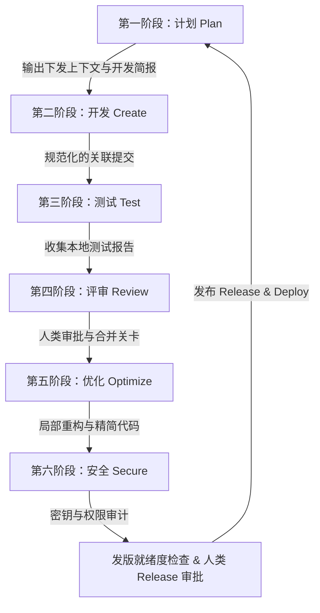
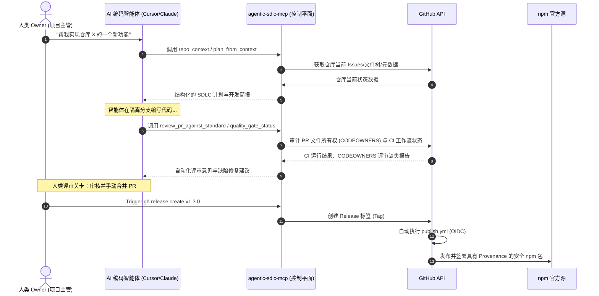

<p align="center">
  
</p>

<h1 align="center">Agentic SDLC Control Plane (agentic-sdlc-mcp)</h1>

<p align="center">
  <b>将专业、结构化的 SDLC 工作流封装为 MCP 工具，引导 AI 编码智能体（如 Claude、Cursor 等）在安全、可追溯且防失控的研生命周期中进行协作。</b>
</p>

<p align="center">
  <a href="https://www.npmjs.com/package/agentic-sdlc-mcp"></a>
  <a href="https://github.com/SakuraCianna/agentic-sdlc-mcp/actions/workflows/ci.yml"></a>
  <a href="https://www.npmjs.com/package/agentic-sdlc-mcp"></a>
  <a href="https://github.com/SakuraCianna/agentic-sdlc-mcp/blob/main/LICENSE"></a>
  <a href="https://modelcontextprotocol.io"></a>
</p>

---

## 💡 项目背景与核心理念

传统的 AI 智能体能够快速生成代码，但常常缺乏软件工程纪律与合规约束。它们可能会在没有测试的情况下直接强推主分支、绕过 PR 评审、无意中泄露密钥，或者未运行 CI 检查就合并代码。

`agentic-sdlc-mcp` 是基于 **Model Context Protocol (MCP)** 构建的 **SDLC 智能编排层与控制平面**。它将 GitHub API 提炼成高层次、富有软件工程纪律的工具，为 AI 编码智能体建立可追溯性、强制性的人类审批关卡、代码质量门禁以及安全性校验。

### 代理式 SDLC 研发闭环


---

## 🛠️ 工具能力分类

本项目并不是对 GitHub API 的简单扁平包装，而是围绕 SDLC 阶段构建的 **12 款专业工具**：

| 分类模块 | 包含工具 | 描述说明 |
|---|---|---|
| **💡 规划与上下文** | [`repo_context`](#repo_context)<br>[`plan_from_context`](#plan_from_context)<br>[`prepare_work_item`](#prepare_work_item) | 检索仓库现状、根据上下文自动拟定 SDLC 阶段计划，并生成可读的智能体开发简报。 |
| **🚀 任务拆解与写入** | [`create_issue_set`](#create_issue_set) | 依据 SDLC 计划在 GitHub 上批量创建对应的 Issues。 |
| **🔍 质量保障与评审** | [`quality_gate_status`](#quality_gate_status)<br>[`create_pr_summary`](#create_pr_summary)<br>[`review_pr_against_standard`](#review_pr_against_standard) | 读取 CI 质量门禁状态、自动生成 PR 的精炼变更摘要，并依据标准等级检查 PR 改动的代码质量。 |
| **🛡️ 治理与安全保障** | [`branch_protection_status`](#branch_protection_status)<br>[`workflow_permissions_audit`](#workflow_permissions_audit)<br>[`security_triage`](#security_triage)<br>[`release_readiness_check`](#release_readiness_check) | 审计主分支保护规则与规则集、审计 Action 工作流权限泄露隐患、收集分析安全漏洞警报并进行发布就绪度核验。 |
| **🤝 智能体交接** | [`agent_handoff_packet`](#agent_handoff_packet) | 汇总当前任务进度和残留事项，打包交接，确保上下文无缝传递。 |

---

## 🗺️ 系统时序架构


---

## ⚡ 快速入门

## 📋 使用前提

运行此服务器前，请确认你已准备好：
1. 本地系统已安装 **Node.js >= 24**。
2. **GitHub 个人访问令牌 (PAT)**：
   * **Classic PAT scopes**：`repo` 与 `security_events`；需要解析组织/团队元数据时再增加 `read:org`。
   * **Fine-grained PAT 仓库读取权限**：Contents、Pull requests、Issues、Checks、Commit statuses、Administration（classic branch protection）、Code scanning alerts、Dependabot alerts、Secret scanning alerts。Metadata read 会自动附带，读取仓库 rulesets 已足够。
   * GraphQL 的 review decision 和关联 Issue 查询复用 Pull requests/Issues 权限；GitHub 不存在单独的“GraphQL read”权限开关。
   * 只有准备以 `dryRun: false` 调用 `create_issue_set` 时才授予 **Issues: write**；v1.6 门禁/审查工具不需要写权限。
     * 注意：如果部分安全端点因权限报错，请以 [GitHub REST API 官方文档](https://docs.github.com/en/rest) 为准核实 Token 权限。

---

## ⚡ 快速入门

### 1. 使用 npx 免安装运行（推荐）
你不需要下载或克隆本仓库。直接在 MCP 客户端配置中通过 npx 运行即可，开箱即用：
```bash
npx -y agentic-sdlc-mcp
```

### 2. 全局安装
你也可以将本包作为全局 CLI 工具安装到系统：
```bash
npm install -g agentic-sdlc-mcp
# 使用全局命令直接启动
agentic-sdlc-mcp
```

### 3. 本地源码运行（用于开发与扩展）
如果你想要修改项目源码或在本地进行功能扩展：
```bash
git clone https://github.com/SakuraCianna/agentic-sdlc-mcp.git
cd agentic-sdlc-mcp
npm install
npm run build
node dist/index.js
```

---

## ✅ 通用 AI Coding Agent 冒烟测试

如果需要在任意支持 MCP 的 AI coding agent 中验证本服务器是否配置成功，请参考客户端无关的指南 [`docs/ai-coding-agent-smoke-test.md`](docs/ai-coding-agent-smoke-test.md)（英文）。其中涵盖最小配置项、仓库坐标回退逻辑、`repo_context` 只读验证路径，以及 `create_issue_set` dry-run 预览（不会真实创建 issue）。

---

## ⚙️ 客户端接入配置

本服务使用 preview MCP Registry 名称 `io.github.SakuraCianna/agentic-sdlc-mcp`；Registry 的 GitHub namespace 大小写敏感，必须与认证账号 login 一致。`npx -y agentic-sdlc-mcp` 仍是兼容性安装入口。

将本服务器注册进你的 MCP 客户端配置文件（例如 `claude_desktop_config.json` 或 Cursor、Windsurf 的配置页面）：

### Claude Desktop / Cursor / Windsurf (使用 npm 官方包运行)
```json
{
  "mcpServers": {
    "agentic-sdlc": {
      "command": "npx",
      "args": ["-y", "agentic-sdlc-mcp"],
      "env": {
        "GITHUB_TOKEN": "ghp_你的_token",
        "GITHUB_OWNER": "你的_github_用户名或组织名",
        "GITHUB_REPO": "你的_目标仓库名"
      }
    }
  }
}
```

### 🔑 全局配置与交互式设置 (持久化)

除了在 MCP 客户端配置中直接指定环境变量之外，您也可以使用交互式命令行来全局设置您的 GitHub 访问凭证。配置会自动持久化在您的用户主目录下（`~/.agentic-sdlc-mcp.json`），后续直接运行工具时将自动读取该全局配置。

#### 1. 命令行交互配置
在终端中直接运行以下命令：
```bash
npx agentic-sdlc-mcp configure
```
工具将启动引导，提示您输入：
* `GITHUB_TOKEN`（核心凭证，[点击前往 GitHub 生成](https://github.com/settings/tokens)，并按上方[使用前提](#-使用前提)的最小权限矩阵配置）
* `GITHUB_OWNER` (默认所有者，可选)
* `GITHUB_REPO` (默认仓库名，可选)

#### 2. 自动配置引导 (TTY)
如果您在终端中直接执行 `npx -y agentic-sdlc-mcp` 启动服务，且当前环境中没有检测到任何 `GITHUB_TOKEN`，工具会自动识别交互式环境并触发上述引导流。如果检测到非交互式环境（如 Claude Desktop 后台静默启动），则会优雅报错并提示配置。

#### 3. 环境变量全局配置 (备用)
您也可以随时在 Shell 中指定全局环境变量（Windows PowerShell 或 macOS/Linux bash）：
```powershell
# Windows PowerShell
$env:GITHUB_TOKEN = "ghp_你的_token"
$env:GITHUB_OWNER = "你的组织或用户名"
$env:GITHUB_REPO  = "你的仓库名"
```

---

## 🎯 最佳实践与合理使用情景

AI 编码智能体不应当在没有任何工程纪律约束下盲目地编写代码和提交。本控制平面旨在帮助 AI 规范研发流程。以下是推荐的智能体协作最佳实践：

### 情景 1：启动新功能开发 / 漏洞修复 (Bootstrapping)
智能体在接受到研发指令时，应依次执行以下工具以获取扎实的背景，避免“盲目写码”反模式：
1. **收集背景**：调用 [`repo_context`](#repo_context) 全面核查当前 Issues、PR 状态及分支结构。
2. **制定计划**：调用 [`plan_from_context`](#plan_from_context) 录入研发目标，自动梳理出涵盖 Plan、Create、Test、Review、Optimize、Secure 完整周期的分阶段计划。
3. **建立 Issues 清单**：调用 [`create_issue_set`](#create_issue_set)（指定 `dryRun: false`）将计划批量创建为 GitHub 上的看板 Issue，供人类和智能体追踪进度。
4. **获取任务简报**：针对当前正要执行的子 Issue，调用 [`prepare_work_item`](#prepare_work_item) 自动提取出目标、非目标、验收标准与核心技术风险。

### 情景 2：Pull Request 提审前的质量把关
在将代码提交给人类进行 PR 评审前，智能体需要执行自检，确信代码符合门禁标准：
1. **生成 PR 变更简要**：调用 [`create_pr_summary`](#create_pr_summary) 自动化输出一份结构化、规范化的 Diff 变更概述与 Release Notes 草案。
2. **核查 CI 门禁**：调用 [`quality_gate_status`](#quality_gate_status) 确保关联的 GitHub Actions 测试与静态检查全部绿灯通过。
3. **代码安全扫描**：调用 [`review_pr_against_standard`](#review_pr_against_standard)（指定 `standard: "strict"` 或 `"security-focused"`）审计提交的差异，防止意外引入 `.env` 敏感密钥，并校验 `.github/CODEOWNERS` 指定的归属人是否已审阅。

### 情景 3：版本发布前就绪度核验 (Pre-release)
当人类主导版本合并并准备正式对外发布包时：
1. **漏洞分级筛选**：调用 [`security_triage`](#security_triage) 检索 Code Scanning (SAST) 静态扫描报告、Dependabot 依赖警告以及 Secret Scanning 泄露警报，排除阻碍发布的致命隐患。
2. **发版就绪度审计**：调用 [`release_readiness_check`](#release_readiness_check) 确认无残留 Bug Issues、确认 CHANGELOG.md 已更新，并自动化出具发版清单与紧急回滚方案模板。
3. **无损交接**：若需要把后续的部署或测试移交给另一个 Agent，调用 [`agent_handoff_packet`](#agent_handoff_packet) 整合当前全部的审计状态进行打包交接。

---

## 📖 工具使用参考 (Tools Reference)

服务器向 AI 客户端暴露的详细工具 API 规范说明：

### `repo_context`
读取仓库元数据、README、package.json 以及未解决的 Issues 和 PR。也可选择性地作为更完整的"开工简报包"使用——探测包管理器、技术栈、常用验证脚本、workflow 文件名、轻量治理信号，以及 agent 规则文件摘要（如 `AGENTS.md`、`CLAUDE.md`）。用于智能体快速熟悉项目上下文。
开启对应参数后，有界的 `readmeSummary` 和 `packageJsonSummary` 也会进入 `structuredContent`，智能体不需要再从 Markdown 文本中重新提取。
* **输入参数**：
  * `owner` (字符串, 可选)：GitHub 所有者。
  * `repo` (字符串, 可选)：GitHub 仓库名。
  * `includeReadme` (布尔值, 默认 `true`)：包含截断后的 README 摘要。
  * `includePackageJson` (布尔值, 默认 `false`)：包含 package.json 摘要、探测到的包管理器（npm/pnpm/yarn/bun）、技术栈和常用脚本（build/test/typecheck/lint/smoke 等）。
  * `includeWorkflows` (布尔值, 默认 `false`)：包含 `.github/workflows/*.yml` 文件名（仅文件名，权限详情请用 `workflow_permissions_audit`）。
  * `includeAgentInstructions` (布尔值, 默认 `false`)：包含仓库根目录下 agent 规则文件（`AGENTS.md`、`CLAUDE.md`）的摘要。
  * `includeGovernance` (布尔值, 默认 `false`)：包含是否存在 CODEOWNERS 文件（完整分支保护详情请用 `branch_protection_status`）。
  * `includePolicy` (布尔值, 默认 `false`)：包含已验证的仓库策略、digest、稳定 rule ID 与来源 ref/blob SHA。
  * `includeOpenIssues` / `includeOpenPRs` (布尔值, 默认 `false`)：包含最近的 open issues/PRs。
  * `issueLimit` / `prLimit` (数字, 默认 `20`, 最大 `100`)：拉取的最长条目数限制。
  * `maxReadmeChars` (数字, 默认 `3000`)：README 截断前的最大字符数。
  * `maxInstructionChars` (数字, 默认 `1000`)：每个 agent 规则文件摘要截断前的最大字符数。

### `plan_from_context`
根据给定的研发目标生成符合 SDLC 标准阶段的阶段性规划，并按 `workType` 定制内容。不同任务类型对应实质不同的计划——例如 `docs` 不会默认要求代码单元测试，`bugfix` 始终包含复现与回归测试，`security` 始终包含威胁模型与最小权限审查，`release`/`infra` 分别始终包含 changelog/回滚计划与 workflow 权限检查。
返回结果还包含 3-5 个结构化 `issueDrafts`，其中包括标题、Markdown body、仓库中已确认存在的标签、SDLC 阶段、验收标准、风险等级和来源目标，可直接传给 `create_issue_set`。
仓库策略可增加默认 work type、required checks、protected path 约束和 review/release 任务；调用方显式 `workType` 始终优先。
* **输入参数**：
  * `owner` / `repo` (字符串, 可选)：仓库坐标。
  * `goal` (字符串, 必填)：要达成的开发目标或修复描述。
  * `workType` (字符串, 可选)：`docs` / `feature` / `bugfix` / `refactor` / `security` / `release` / `infra` 之一。省略时会根据 `goal` + `acceptanceCriteria` 通过保守的关键词启发式推断——返回结果中的 `confidence`（`high`/`medium`/`low`）与 `needsClarification` 字段说明推断是否可信，不可信时应显式传入 `workType`。
  * `constraints` (字符串数组, 可选)：技术或业务约束。
  * `acceptanceCriteria` (字符串数组, 可选)：明确的验收标准（同时也用于 workType 推断）。

### `create_issue_set`
根据规划预览或批量创建 GitHub Issues。dry-run 会在不调用 GitHub 写接口的前提下返回目标仓库、最终标题、标签、body 摘要和人工审查 warning；真实批次会保留成功创建的 issue number/URL，并为失败项返回安全化原因，单个失败不会掩盖已有成功结果或阻止后续尝试。
* **输入参数**：
  * `owner` / `repo` (字符串, 可选)：仓库坐标。
  * `issues` (对象数组, 必填)：拟创建的 Issues 结构列表（包含标题、内容、标签和可选 assignees），可直接接收 `plan_from_context.issueDrafts`。
  * `dryRun` (布尔值, 默认 `true`)：默认开启预览模式，为 `false` 时真实写入 GitHub。

### `prepare_work_item`
为指定 Issue 生成供 AI 智能体直接消费的开发简报，提取目标、非目标、验收标准与核心风险。
* **输入参数**：
  * `owner` / `repo` (字符串, 可选)：仓库坐标。
  * `issueNumber` (数字, 必填)：绑定的 GitHub Issue 编号。
  * `includeRelatedFiles` (布尔值, 默认 `false`)：启发式搜索 Issue 内容中提及的关联文件。
  * `includeRecentPRs` (布尔值, 默认 `false`)：检索最近关联的 5 个已合并 PR。

### `quality_gate_status`
聚合 check runs 与 commit statuses；PR 模式还会评估 reviews、CODEOWNERS 路由、draft/mergeability、分支保护/rulesets、阻塞标签和关联 Issues。六种结论为 `passing`、`failing`、`pending`、`needs_review`、`policy_gap`、`no_evidence`。权限失败或有界数据源被截断时，会通过 `degraded`、`unverifiedSignals` 和安全化 `errors` 明确暴露，绝不会把缺失证据伪装成通过。
* **输入参数**：
  * `owner` / `repo` (字符串, 可选)：仓库坐标。
  * `pullNumber` (数字, 可选)：待查询的 PR 编号。
  * `ref` (字符串, 可选)：待查询的分支或 commit。
  * `blockingLabels` (字符串数组, 默认 `blocked`、`do-not-merge`、`release-blocker`、`security-blocker`)：精确、大小写不敏感的 PR 阻塞标签；传入 `[]` 可关闭这组内置默认值。

PR 策略固定从 base SHA 读取；调用方覆盖或 PR 自身修改策略都不能移除仓库 required checks/labels。

### `create_pr_summary`
针对指定的 PR，自动生成结构化的内容变更摘要和更新日志草案。
* **输入参数**：
  * `owner` / `repo` (字符串, 可选)：仓库坐标。
  * `pullNumber` (数字, 必填)：PR 编号。

### `review_pr_against_standard`
依据 SDLC 安全级别规范（`basic` / `strict` / `security-focused`）对 PR 修改的代码行执行自动化评审。

调用方可以显式指定 `workType` 为 `docs`、`feature`、`bugfix`、`refactor`、`security`、`release` 或 `infra`；省略时会保守推断并返回置信度和理由。结构化输出为每条 finding 增加 `dimension`、`paths`、`reason`，并返回 `releaseRisk`、`testCoverageSignal`、`ownershipRoutingGaps`。docs-only 要求文档验证而非代码单元测试；bugfix 要求复现/回归证据；workflow/infra 会读取 PR head SHA 的完整 workflow，检查触发条件、最小权限、失败路径和回滚证据。

`security-focused` 只有在验证具体 Actions job URL、workflow run、PR head SHA、唯一匹配的 base ref workflow job，以及 job 内已知 scanner action 使用完整 commit SHA 固定后，才把 Gitleaks 或 TruffleHog 作为主要通过证据。Secretlint、detect-secrets 与 GitHub Secret Scanning 名称仍会被识别并显示，但 v1.6 无法把它们绑定到等价的不可变 workflow provenance 链，因此只能作为 unverified claim。同名/重名 job 或 status、未知 App 的 check、条件执行/允许失败的 scanner job 或 step 和可变 action tag 都不能证明扫描通过。证据不完整、PR 修改扫描策略、未运行 provenance-supported scanner、仍在 pending 或扫描失败时都会采用 fail-closed 结论。内置的新增赋值行启发式检查只作为补充，绝不会被表述为“仓库不存在密钥泄露”的证明。

补充 scanner 会在所有 review standard 下运行；credential-like 字段或认证头 API sink 通过字符串拼接/格式化、常见 JavaScript/Java/Go/Rust/Python/Ruby/PHP/Kotlin/Swift 插值或 builder 形式、`.concat()`/`.join()`、常见解码调用、多行 statement，或有界的补丁内动态字段别名组装时返回 `DynamicSecretConstruction`。实现保留 diff hunk 与 statement 边界，限制别名及输入/输出增长，并聚合重复 finding。显式环境变量/secret manager 来源、注释、删除行，以及 `tokenCount` 这类 credential 元数据会被排除以降低噪音。它只做 patch-local 风险识别，不是全程序数据流分析；跨函数/跨文件的间接构造或完全未知的动态键仍需可信 scanner、CodeQL/SAST 与人工审查。

* **输入参数**：
  * `owner` / `repo` (字符串, 可选)：仓库坐标。
  * `pullNumber` (数字, 必填)：PR 编号。
  * `standard` (字符串, 默认 `"basic"`)：执行标准的严格度。
  * `workType` (字符串, 可选)：显式任务类型；省略时根据 PR 元数据和路径推断。
  * `checkOwnership` (布尔值, 默认 `true`)：检查修改的文件是否通过 `.github/CODEOWNERS` 指定了归属人且已执行审阅。

### `security_triage`
收集并分类过滤目标仓库的 Code Scanning 静态扫描、Dependabot 依赖审计和 Secret Scanning 密钥泄露警报。
* **输入参数**：
  * `owner` / `repo` (字符串, 可选)：仓库坐标。

### `release_readiness_check`
发布前准备就绪度核查，聚合 check runs 与 commit statuses，检查未决 Bug 和 CHANGELOG，并生成回滚方案。只有 CI 明确为 `passing` 才会判定可发布；`pending`、`unknown`、零信号或失败都会阻塞。
* **输入参数**：
  * `owner` / `repo` (字符串, 可选)：仓库坐标。
  * `headRef` (字符串, 可选)：准备发布的 tag/分支。
  * `pullNumber` (数字, 可选)：检查 PR head 与真实阻断标签。
  * `rollbackPlanEvidence` (对象, 可选)：调用方提供的 `{ reference, tested }`；策略要求已测试回滚方案时必须提供。

### 仓库策略

通过 `.agentic-sdlc.yml` 增强 checks、protected paths、reviewers、阻断标签与发布要求。完整 schema、示例、provenance、base-SHA 自修改防护、限制与迁移见 [仓库策略指南](docs/repository-policy.md)。

### `branch_protection_status`
读取当前分支的分支保护配置与仓库规则集（Rulesets），分析保护强推、分支删除、合并审核机制是否缺失。
* **输入参数**：
  * `owner` / `repo` (字符串, 可选)：仓库坐标。
  * `branch` (字符串, 可选)：目标分支名称，默认仓库的默认分支。

### `workflow_permissions_audit`
所有的写入类工具都强制集成了 `dryRun` (空跑) 机制：

| `dryRun` 参数值 | 实际效果 |
|---|---|
| `true` (默认) | 预览模式 —— 不会对 GitHub API 进行任何真实修改 |
| `false` | 写入模式 —— 真实修改 GitHub 仓库内容 |

系统始终默认 `dryRun: true`。Agent 必须明确指定 `dryRun: false` 才能执行写入操作，这能有效防止 AI 的幻觉导致破坏性操作。
预览结果会明确显示目标仓库和 warning；真实批次会同时保留成功项与安全化失败信息，避免部分完成状态被隐藏。

---

## 典型工作流示例

### 1. 开启一个新功能开发

```
1. repo_context                  # 了解仓库基线背景
2. plan_from_context (goal=...)  # 依据目标生成 SDLC 计划
3. create_issue_set (dryRun:true) # 预览将要创建的 Issues
4. create_issue_set (dryRun:false) # 正式在 GitHub 创建 Issues
5. prepare_work_item (issueNumber=N) # 提取某一个 Issue 为当前 Agent 准备任务简报
```

### 2. 审查 Pull Request

```
1. create_pr_summary (pullNumber=N)             # 获取全局 Diff 概览
2. quality_gate_status (pullNumber=N)            # 检查 CI/CD 状态
3. review_pr_against_standard (standard:strict)  # 按严格标准找出代码质量问题
```

### 3. 发版前的终极检查

```
1. security_triage                # 检查各类安全警报
2. release_readiness_check        # 评估发版就绪度
3. (解决任何阻塞型 Issues)
4. 人类审批通过后打 Tag 发版
```

---

## 安全注意事项

- **绝不要**把你的 `GITHUB_TOKEN` 提交到代码库中 —— 始终使用 `.env` 文件或 PowerShell `$env:` 环境变量。
- 默认的 `dryRun: true` 保护机制可以防止代码库被意外修改。
- 本工具不支持自动合并 (Auto-merge)、不强制推送 (Force-push)、不支持删除分支操作。
- v1.7 的策略感知门禁、PR 审查、workflow 审计、安全分诊、发布就绪与 handoff 工具只读取证据，不会批准或合并 PR，也不会修改分支保护、rulesets 或仓库策略；单独的 Issue 创建工具仍默认受 `dryRun: true` 保护。
- Secret scanning (密钥扫描) 警报始终被评级为最高危 (`critical`)。
- 服务器除了调用官方 GitHub API 之外，不发起任何额外的出站外网请求。

---

## 本地开发指南

```powershell
# 类型检查
npm run typecheck

# 监听模式 (热重载)
npm run dev

# 构建项目
npm run build

# 运行测试
npm run test

# 冒烟测试 (不需要提供真实的 GitHub Token)
npm run smoke
```

---

## 发布指南 (维护者专用)

本包通过 **Trusted Publishing (OIDC 可信发布)** 方式发布到 npm —— 仓库中不存储任何长期有效的 `NPM_TOKEN` 密钥。发布流程由 `.github/workflows/publish.yml` 负责执行。

### npm 官网一次性配置步骤

1. 登录 [npmjs.com](https://www.npmjs.com)，进入该包的 **Settings -> Publishing access** 页面。
2. 添加一个 **Trusted Publisher (可信发布者)**，填写：
   - Provider (提供方): `GitHub Actions`
   - Repository (仓库): `SakuraCianna/agentic-sdlc-mcp`
   - Workflow filename (工作流文件名): `publish.yml`
3. 保存。此后 `publish.yml` 即可在不使用任何 npm token 的情况下完成发布 —— GitHub 会签发一个短期有效的 OIDC token，npm 用它换取发布凭证，并自动生成 provenance (来源证明)。

> **首次发布例外**：如果该包名在 npm 上尚不存在，则无法预先绑定 Trusted Publisher (必须先有包才能配置)。此时需要先在本地用经典 token 手动执行一次 `npm publish`，之后的所有发布再切换为 Trusted Publishing。`publish.yml` 工作流本身始终使用 OIDC 方式，不会退回到 token 方式。

### 如何触发一次发布

- **推荐方式**：在 GitHub 上创建一个 Release (打 Tag 后点击 "Publish release")，这会触发 `release: published` 事件，自动运行 `publish.yml`。
- **手动方式**：进入 **Actions -> Publish to npm -> Run workflow** 手动触发 (`workflow_dispatch`)。

### 发布前本地检查清单

```powershell
npm run typecheck
npm run build
npm run test
npm run smoke
npm run test:coverage
npm pack --dry-run
```

`npm pack --dry-run` 会列出即将打包进发布压缩包的所有文件，但不会真正生成压缩包。请确认其中只包含 `dist/`、`README.md` 和 `.env.example` —— 测试文件和 `package-lock.json` 不应出现在其中 (这由 `tsconfig.build.json` 保证，它在编译用于发布的 `dist/` 输出时排除了 `src/__tests__/**`)。

### GitHub Actions 工作流说明

| 工作流 | 触发条件 | 作用 |
|---|---|---|
| `.github/workflows/ci.yml` | `pull_request`、推送到 `main` | 在 Node 24 上运行类型检查、构建、测试、冒烟测试和覆盖率检查 |
| `.github/workflows/secret-scan.yml` | `pull_request`、推送到 `main`、手动触发 | 使用只读权限运行固定提交版本的 Gitleaks，作为主要成熟密钥扫描证据 |
| `.github/workflows/publish.yml` | GitHub Release 发布、或手动触发 | 通过 OIDC Trusted Publishing 方式发布到 npm |
| `.github/dependabot.yml` | 每周定时 | 自动提交 npm 依赖与 GitHub Actions 依赖的更新 PR (打上 `dependencies` 标签) |

---

## 开源协议

MIT License
