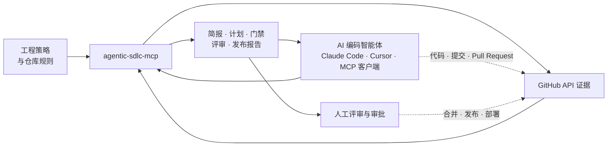

<p align="center">
  
</p>

<h1 align="center">agentic-sdlc-mcp</h1>

<p align="center">
  <strong>为在真实 GitHub 仓库中工作的 AI 编码智能体提供治理与证据控制。</strong>
</p>

<p align="center">
  让 Claude Code、Cursor 和其他模型上下文协议（MCP）客户端在仓库上下文、评审门禁、安全证据与人工审批点的约束下工作。
</p>

<p align="center">
  <a href="README.md">English</a> ·
  <a href="https://www.npmjs.com/package/agentic-sdlc-mcp">npm</a> ·
  <a href="https://registry.modelcontextprotocol.io/v0.1/servers?search=io.github.SakuraCianna%2Fagentic-sdlc-mcp">MCP Registry</a> ·
  <a href="docs/ROADMAP.md">路线图</a>
</p>

<p align="center">
  <a href="https://www.npmjs.com/package/agentic-sdlc-mcp"></a>
  <a href="https://www.npmjs.com/package/agentic-sdlc-mcp"></a>
  <a href="https://github.com/SakuraCianna/agentic-sdlc-mcp/actions/workflows/ci.yml"></a>
  
  <a href="LICENSE"></a>
</p>

`agentic-sdlc-mcp` 是面向已经允许 AI 编码智能体修改生产仓库团队的软件开发生命周期（SDLC）治理层。它把 GitHub 上下文、仓库策略、检查、评审、安全告警和发布信号组织成 12 个工作流级 MCP 工具。其中 11 个工具只读，唯一的 GitHub 写入工具默认先预览。

## 接入这个 MCP 后有什么变化

AI 编码智能体可以生成代码和 Pull Request，但它未必理解仓库的全部规则。这个 MCP 为智能体提供有界上下文，也让评审者看到明确的证据缺口，而不是再收到一份无法验证的自由文本总结。

| 关注点 | 未接入这个 MCP | 接入 `agentic-sdlc-mcp` 后 |
|---|---|---|
| 仓库上下文 | 智能体从用户提示词出发，自行猜测项目约定 | `repo_context` 读取有界的元数据、脚本、策略、Issues、Pull Requests 和智能体规则 |
| 高风险业务 | 认证、支付、迁移和 Workflow 变更使用通用计划 | `prepare_work_item` 补充风险理由、防御性要求、负向场景、回滚和可观测性 |
| Issue 规划 | 人工把计划重新整理成 GitHub 工作项 | `plan_from_context` 生成结构化草稿，`create_issue_set` 先展示精确写入内容 |
| Pull Request 门禁 | 智能体可能把持续集成（CI）绿灯当成充分证据 | `quality_gate_status` 分离 checks、reviews、ownership、保护规则、标签和缺失证据 |
| 密钥风险 | 只根据扫描器名称或关键词判断是否安全 | PR 审查区分可信扫描证据、有界补丁启发式和未验证缺口 |
| 发布与交接 | 就绪度依赖自由文本状态总结 | 发布和交接工具保留阻塞项、策略义务、证据警告和人工审批点 |

这个 MCP 不编写代码、不合并 Pull Request、不强制推送、不创建 Release、不部署软件，也不能替代人工安全评审。

## 它如何进入生产级智能体工作流

这个 MCP 位于 AI 编码智能体与 GitHub 证据之间。仓库变更仍由智能体通过原有开发环境完成，高影响决策仍由团队负责。



## 适用场景

当自主智能体可能猜测仓库状态或依赖过期文字说明时，使用这些工具生成可审查的决策材料。

| 生产场景 | 推荐工具 | 产生的决策材料 |
|---|---|---|
| 让智能体接手陌生的生产仓库 | `repo_context` | 包含脚本、Workflows、策略、待办工作和已知缺口的仓库简报 |
| 把功能、Bug 或安全目标转换为可评审工作项 | `plan_from_context` → `create_issue_set` | 按任务类型生成的计划、Issue 草稿和预览优先的 GitHub Issues |
| 准备认证、支付、迁移或基础设施工作 | `prepare_work_item` | 包含防御性要求、负向测试、回滚和可观测性的风险简报 |
| 检测补丁中的动态凭据构造 | `review_pr_against_standard` | 针对拼接、插值、解码、别名和认证头 sink 的补丁内风险发现 |
| 判断 Pull Request 是否具备人工评审条件 | `create_pr_summary` → `quality_gate_status` → `review_pr_against_standard` | Diff 摘要、合并门禁证据、问题、阻塞项和下一步动作 |
| 审计仓库治理 | `branch_protection_status` → `workflow_permissions_audit` | 分支/Ruleset 证据和 GitHub Actions 最小权限问题 |
| 判断版本是否可以进入人工发布审批 | `security_triage` → `release_readiness_check` | 安全告警摘要、CI 证据、发布阻塞项、CHANGELOG 和回滚要求 |
| 把工作移交给另一个智能体 | `agent_handoff_packet` | 标注调用方断言与证据警告的有界续接包 |

## 从 npm 安装

你需要 Node.js 24 或更高版本。优先直接运行 npm 上已经发布的包：

```powershell
npx -y agentic-sdlc-mcp
```

如果需要全局 CLI：

```powershell
npm install -g agentic-sdlc-mcp
agentic-sdlc-mcp
```

默认传输方式是 stdio。多数 MCP 客户端会自动启动这个包，不需要提前在另一个终端中运行。

## 让编码智能体帮你安装

把下面的提示词复制到 Codex、Claude Code 或其他编码智能体：

```text
请使用 npm install -g agentic-sdlc-mcp 全局安装并配置这个 MCP。项目地址：https://github.com/SakuraCianna/agentic-sdlc-mcp
请通过 MCP 客户端的 secret 或环境变量配置 GITHUB_TOKEN 和可选仓库默认值；在可信的单用户设备上，也可以运行 agentic-sdlc-mcp configure，或写入 ~/.agentic-sdlc-mcp.json。不要在对话、日志或仓库文件中暴露 Token；缺少非敏感信息时向我询问。
完成后调用只读的 repo_context 工具验证连接，并说明主要能力、所需 GitHub 权限和安全边界。
```

批准前请检查智能体准备执行的命令和配置变更。安装需要 Node.js 24 或更高版本。

## 连接 MCP 客户端

把服务器添加到 Claude Desktop、Cursor、Windsurf 或其他 MCP 客户端。通过客户端的 secret 或环境变量配置注入 GitHub token。

```json
{
  "mcpServers": {
    "agentic-sdlc": {
      "command": "npx",
      "args": ["-y", "agentic-sdlc-mcp"],
      "env": {
        "GITHUB_TOKEN": "your_github_token_here",
        "GITHUB_OWNER": "your_organization",
        "GITHUB_REPO": "your_repository"
      }
    }
  }
}
```

部分 Windows MCP 客户端需要通过 `cmd` 调用 `npx`：

```json
{
  "command": "cmd",
  "args": ["/c", "npx", "-y", "agentic-sdlc-mcp"]
}
```

`GITHUB_OWNER` 和 `GITHUB_REPO` 是可选默认值，工具调用也可以显式传入仓库坐标。请根据 [GitHub 权限矩阵](#github-权限) 只授予已启用能力所需的权限。

<details>
<summary>本地交互式配置</summary>

```powershell
npx -y agentic-sdlc-mcp configure
```

这个兼容路径会把配置写入 `~/.agentic-sdlc-mcp.json`，其中包括 GitHub token。它只适合可信的单用户工作站。面向生产的接入应优先使用 MCP 客户端 secret 注入或进程环境变量。

</details>

## 验证连接

先执行一次只读调用，在授予写权限前确认仓库边界：

```text
使用 agentic-sdlc-mcp 对当前配置仓库执行 repo_context，包含 package scripts、workflows、governance 和 repository policy。不要创建 Issue，也不要修改 GitHub。
```

再通过 dry-run 验证写入边界，不创建任何内容：

```text
生成一个 feature 计划，把 issue drafts 传给 create_issue_set，并设置 dryRun: true。显示目标仓库、标题、标签、body 摘要和警告。不要写入 GitHub。
```

完整的五分钟验证路径见[通用 AI 编码智能体冒烟测试](docs/ai-coding-agent-smoke-test.md)。

## Tools 工具目录

服务器注册了 12 个工作流级工具。MCP 客户端会在运行时获得完整输入输出 schema；下面的目录说明何时调用工具，以及如何理解结果。

| 工具 | 适用时机 | 主要结果 | 访问模式 |
|---|---|---|---|
| `repo_context` | 智能体在规划前需要仓库事实 | 包含元数据、README/package 摘要、脚本、Workflows、治理、策略、Issues 和 PRs 的有界简报 | 只读 |
| `plan_from_context` | 一个目标需要 SDLC 计划和 Issue 草稿 | 按任务类型生成的计划、置信度、澄清信号和 3 至 5 个结构化 Issue 草稿 | 只读 |
| `prepare_work_item` | 智能体准备实现某个 GitHub Issue | 风险画像、分来源验收标准、防御性要求、关联证据、回滚和交接提示词 | 只读 |
| `create_issue_set` | 已评审计划需要转换为 GitHub Issues | 精确 dry-run 预览，或保留部分成功信息的真实创建结果 | 预览优先写入 |
| `create_pr_summary` | Pull Request 需要可评审概览 | 变更摘要、影响文件、测试信号、风险、清单和 Release Notes 草稿 | 只读 |
| `quality_gate_status` | 团队需要真实合并门禁证据 | `passing`、`failing`、`pending`、`needs_review`、`policy_gap` 或 `no_evidence`，以及阻塞项和缺口 | 只读 |
| `review_pr_against_standard` | Pull Request 需要 SDLC 与安全评审 | 结构化 findings、发布风险、测试证据、ownership 缺口和扫描器 provenance | 只读 |
| `branch_protection_status` | 团队需要分支和 Ruleset 可见性 | 必需评审、状态检查、强推与删除设置和验证缺口 | 只读 |
| `workflow_permissions_audit` | 需要评审 GitHub Actions token 权限 | 顶层与 job 级权限问题和最小权限建议 | 只读 |
| `security_triage` | 发布或事故处理需要 GitHub 安全告警 | Code Scanning、Dependabot 和 Secret Scanning 分诊 | 只读 |
| `release_readiness_check` | 人工正在决定是否发布 | CI 状态、阻塞 Issue/标签、CHANGELOG 与回滚证据、阻塞项和下一步 | 只读 |
| `agent_handoff_packet` | 另一个智能体需要继续当前工作 | 紧凑的 Issue/PR 上下文、策略义务、调用方断言、警告和有序下一步 | 只读 |

<details>
<summary>上下文与规划细节</summary>

- **`repo_context`**：默认返回有界 README 摘要。可以选择读取 package scripts、Workflow 文件名、智能体规则、governance、经过验证的 `.agentic-sdlc.yml` 和最近待办工作。所有条目和字符数量都有明确上限，来源缺失时返回降级上下文，不编造事实。
- **`plan_from_context`**：支持 `docs`、`feature`、`bugfix`、`refactor`、`security`、`release` 和 `infra`。省略类型时，工具会返回推断结果、置信度、理由和 `needsClarification`。仓库策略可以添加 required checks 和 protected-path 义务，调用方显式传入的 work type 优先。
- **`prepare_work_item`**：读取有界 Issue/评论证据、确认存在的根目录脚本、仓库策略、Milestone 上下文，以及可选的关联文件、GitHub 官方 Issue 关系和近期 PR 历史。它会分离 Issue 原始验收标准与派生要求，深度证据路径会暴露请求预算和不完整来源警告。

</details>

<details>
<summary>工作项写入细节</summary>

- **`create_issue_set`**：可以直接接收 `plan_from_context.issueDrafts`。`dryRun` 默认为 `true`，不会调用 GitHub 写接口。真实批次必须显式设置 `dryRun: false`，会保留成功创建的 Issue URL，并返回安全化的逐项失败信息，不隐藏部分完成状态。

</details>

<details>
<summary>Pull Request 证据细节</summary>

- **`create_pr_summary`**：限制文件证据数量并报告截断。纯文档 PR 会收到文档验证建议，而不是错误的“缺少代码单元测试”警告。
- **`quality_gate_status`**：PR 模式会组合 checks、commit statuses、reviews、CODEOWNERS 路由、draft/merge 状态、classic branch protection、Rulesets、阻塞标签、关联 Issues 和 base-SHA 仓库策略。权限失败会继续以 degraded 或 unverified evidence 显示。
- **`review_pr_against_standard`**：支持 `basic`、`strict` 和 `security-focused`。只有当 check、Workflow、PR head SHA、base Workflow job、扫描器 action 和不可变 action SHA 可以关联时，才把 Gitleaks 或 TruffleHog 作为主要通过证据。动态密钥构造扫描器是有界的补丁内分析，不是全程序数据流分析，也不能证明仓库不存在密钥泄漏。

</details>

<details>
<summary>治理与发布细节</summary>

- **`branch_protection_status`**：读取 classic branch protection 和 repository Rulesets。缺少 Administration 权限时会报告验证缺口，不会直接声称分支没有保护。
- **`workflow_permissions_audit`**：读取 `.github/workflows/*.yml`，评估仓库级和 job 级 `permissions` 声明。它不会修改 Workflow 文件或仓库设置。
- **`security_triage`**：读取 Code Scanning、Dependabot 和 Secret Scanning 告警。可用结果取决于仓库功能和 token 权限。
- **`release_readiness_check`**：要求 CI 存在明确的 passing 证据。pending、unknown、失败或零信号都会阻塞就绪结论。仓库策略还可以要求 CHANGELOG 和已测试回滚证据。

</details>

<details>
<summary>交接细节</summary>

- **`agent_handoff_packet`**：组合有界的调用方状态、Issue/PR 上下文、可用时的不可变 base-SHA 策略、已完成工作、剩余步骤和证据警告。调用方提供的状态始终保留为 assertion，而不是系统验证。这个包不能批准、合并、发布或启动另一个智能体。

</details>

服务器还通过 `sdlc://` 暴露五个只读资源，分别提供 SDLC 标准以及 Issue、PR 摘要、发布就绪和交接模板。

## 常用工作流

这些顺序可以降低工具选择歧义，每条流程最终都保留人工决策。

```text
开始工作
repo_context → plan_from_context → create_issue_set (dryRun: true)
→ 人工确认工作项 → create_issue_set (dryRun: false)
→ prepare_work_item

评审 Pull Request
create_pr_summary → quality_gate_status → review_pr_against_standard
→ 人工评审 findings 并决定是否合并

评审仓库治理
branch_protection_status → workflow_permissions_audit → security_triage
→ 仓库负责人决定修改哪些设置或 Workflows

准备发布
security_triage → release_readiness_check
→ 人工批准 Tag、Release 和部署

移交工作
相关证据工具 → agent_handoff_packet
→ 下一位智能体先验证过期状态和调用方断言，再继续执行
```

## GitHub 权限

不要默认授予所有权限。请根据团队启用的工具选择所需权限，并先在非生产仓库验证。

| 能力 | Fine-grained 仓库权限 | Classic PAT scope | 使用方 |
|---|---|---|---|
| 仓库元数据与文件 | Metadata read、Contents read | `repo` 或 `public_repo` | 上下文、策略、Workflow、评审、CHANGELOG 和 CODEOWNERS 证据 |
| Issues | Issues read | `repo` 或 `public_repo` | 上下文、规划、工作项简报、门禁、发布和交接 |
| Pull Requests 与评审 | Pull requests read | `repo` 或 `public_repo` | PR 摘要、门禁、评审和交接 |
| Checks 与 statuses | Checks read、Commit statuses read | `repo` 或 `public_repo` | 质量门禁、发布就绪和可信扫描证据 |
| Actions provenance | Actions read | `repo` 或 `public_repo` | 读取可信扫描证据背后的 workflow run、job 和 workflow 身份 |
| 分支保护 | Administration read | `repo` 或 `public_repo` | Classic branch protection；repository Rulesets 使用 Metadata read |
| Code scanning alerts | Code scanning alerts read | `security_events` | `security_triage` |
| Dependabot alerts | Dependabot alerts read | `security_events` | `security_triage` |
| Secret scanning alerts | Secret scanning alerts read | `security_events` | `security_triage` |
| 创建 Issues | Issues write | `repo` 或 `public_repo` | 仅 `create_issue_set` 且 `dryRun: false` |

GitHub 权限和端点要求可能变化。出现权限错误时，请核对 [GitHub REST API fine-grained PAT 权限文档](https://docs.github.com/en/rest/authentication/permissions-required-for-fine-grained-personal-access-tokens)。缺少可选权限可能产生 degraded 或 unverified evidence，这并不意味着需要授予无关权限。

## 安全模型与信任边界

这个服务器约束的是自身工具，不能控制外围 AI 智能体或 MCP 客户端拥有的其他能力。

- **一个预览优先的写入工具**：`create_issue_set` 是唯一的 GitHub 写入工具，默认 `dryRun: true`
- **不提供高权限仓库变更**：没有 merge、approval、force-push、分支删除、分支规则修改、Release 创建或部署工具
- **人工门禁位于系统之外**：服务器报告 CODEOWNERS、评审、策略、CI、安全和发布证据，最终决定由 GitHub 与团队执行
- **证据始终保留限定条件**：缺失、过期、截断、格式异常或受权限限制的来源会继续显示为缺口
- **仓库策略绑定 base SHA**：可用时，PR 策略从 base SHA 读取，Pull Request 不能静默降低自身门禁
- **外部文本不受信任**：Issue body、评论、PR 元数据、文件名和日志进入 Markdown 或交接提示词前会受到长度限制和转义
- **密钥检测存在边界**：可信扫描器 provenance 与补丁启发式可以降低风险，但跨文件或运行时数据流仍需 CodeQL 或其他静态应用安全测试（SAST）、密钥扫描器、测试和人工评审
- **凭据仍由接入方负责**：优先使用客户端 secret 注入或环境变量，不要把 token 提交到仓库，也不要粘贴到 Issue、PR 或日志内容中
- **本地 HTTP 不能直接远程使用**：当前 HTTP profile 没有 MCP OAuth、租户身份、限流或产品级 timeout/cancellation 预算

`.agentic-sdlc.yml` 的 schema、provenance、限制和 base-SHA 自修改防护见[仓库策略指南](docs/repository-policy.md)。对抗测试矩阵和覆盖率规则见[测试策略](docs/testing-strategy.md)。

## 仓库策略与 Resources

当仓库专属 checks、protected paths、reviewers、阻塞标签、CHANGELOG 和回滚要求需要影响工具结论时，添加 `.agentic-sdlc.yml`。策略输出包含来源 ref、blob SHA、digest、稳定 rule IDs 和警告。

静态资源使用 `sdlc://` scheme：

| Resource | 用途 |
|---|---|
| `sdlc://standards/agentic-sdlc` | Agentic SDLC 参考标准 |
| `sdlc://templates/issue` | 结构化 GitHub Issue 模板 |
| `sdlc://templates/pr-summary` | Pull Request 摘要模板 |
| `sdlc://templates/release-readiness` | 发布前检查清单 |
| `sdlc://templates/handoff` | 智能体续接模板 |

## 本地 HTTP profile

stdio 是默认且推荐的本地传输方式。需要 Streamable HTTP 的本机客户端可以在源码构建后显式启用：

```powershell
$env:TRANSPORT = "http"
$env:PORT = "3000"
node dist/index.js
```

服务端点为 `http://127.0.0.1:3000/mcp`。它只监听 loopback，校验 `Host` 和调用方提供的 `Origin`；每个 POST 使用隔离的无状态 server/transport；不支持的 GET/DELETE session 操作会被拒绝；错误细节受到限制，并支持关闭信号。

不要把该端点暴露到其他机器，也不要直接通过反向代理对外提供。远程 OAuth、调用方级凭据、租户隔离、限流和明确请求预算计划在 v1.10 实现。

## 本地开发与项目链接

只有需要贡献代码或检查实现时才需要克隆仓库：

```powershell
git clone https://github.com/SakuraCianna/agentic-sdlc-mcp.git
Set-Location agentic-sdlc-mcp
npm install
npm run build
npm run test
```

| 命令 | 用途 |
|---|---|
| `npm run typecheck` | 检查 TypeScript 类型 |
| `npm run build` | 构建 `dist/` |
| `npm run test` | 运行完整 Vitest 测试套件 |
| `npm run test:integration` | 运行配置与 MCP runtime 集成测试 |
| `npm run test:coverage` | 执行覆盖率门槛并生成报告 |
| `npm run smoke` | 在没有 GitHub 凭据时验证注册与加载 |
| `npm run check:line-endings` | 拒绝 CRLF 和混合行尾 |

## 通过 Issue 和 Pull Request 参与贡献

欢迎提交 Issue 和 Pull Request。开始前请查看[现有 Issues](https://github.com/SakuraCianna/agentic-sdlc-mcp/issues)与[路线图](docs/ROADMAP.md)。如果变更会影响公开行为、安全边界、工具 schema 或架构，请先创建 Issue 讨论。

1. Fork 仓库，并基于最新 `main` 创建范围明确的分支。
2. 运行 `npm ci`，然后只修改本次贡献所需内容。
3. 行为发生变化时，同步补充或更新测试与文档。
4. 运行与变更相关的检查。完整 CI 会执行 `npm run check:line-endings`、`npm run typecheck`、`npm run build`、`npm run test`、`npm run smoke` 和 `npm run test:coverage`。
5. 创建目标为 `main` 的 Pull Request，并说明问题、解决方案、风险、验证结果和关联 Issues。

不要把 token、凭据、私有仓库内容或本地生成的配置提交到 commit、Issue、Pull Request 或日志。CI 通过是评审证据，但不能替代维护者批准。

- [路线图](docs/ROADMAP.md)
- [仓库策略指南](docs/repository-policy.md)
- [测试策略](docs/testing-strategy.md)
- [AI 编码智能体冒烟测试](docs/ai-coding-agent-smoke-test.md)
- [更新日志](CHANGELOG.md)
- [Releases](https://github.com/SakuraCianna/agentic-sdlc-mcp/releases)
- [开放 Issues](https://github.com/SakuraCianna/agentic-sdlc-mcp/issues)

npm 与 MCP Registry 工作流使用 GitHub OpenID Connect（OIDC）可信发布。发布 GitHub Release 会同时触发两个工作流；Registry 工作流会等待该精确 npm 版本可用，再发布版本一致、不可变的 stdio metadata。

## 开源协议

[MIT](LICENSE)
