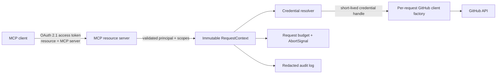

# 远程部署重新立项准入条件

## 当前决定

`agentic-sdlc-mcp` 当前只面向可信本机运行：

- 默认 stdio；
- 可选 Streamable HTTP 只监听 loopback；
- 单用户、进程级 GitHub credential 与仓库默认值；
- 不提供 remote OAuth、多租户、托管 SaaS 或公网部署 profile。

当前本地 HTTP 不能通过修改监听地址或增加反向代理直接变成远程服务。本文只是未来重新立项时的安全与架构门槛，不代表版本承诺。

## 为什么不能直接远程化

当前进程级 config 与 Octokit client 适合单用户本地进程，但远程场景会引入两套不同身份：

1. MCP 调用方身份：谁可以调用服务、允许调用哪些工具。
2. GitHub 身份：该调用方可以访问哪些组织、仓库和 API。

两者不能共用一个 bearer token，也不能把 GitHub PAT 当作 MCP access token。否则会产生 confused deputy、跨租户 credential 混用、缓存串线和权限扩大风险。

## 重新立项时的目标架构



### 1. MCP Authorization 层

- 按当前 [MCP Authorization 规范](https://modelcontextprotocol.io/specification/2025-11-25/basic/authorization)实现 OAuth 2.1 resource server。
- 发布 OAuth Protected Resource Metadata，并支持 authorization server discovery。
- 在授权和 token 请求中使用明确的 MCP resource identifier。
- 每个请求校验 issuer、audience/resource、expiry、signature、client 与 scopes。
- access token 只通过 `Authorization: Bearer` header 传递，不进入 URL、日志或缓存 key。
- scope 不足时返回规范的 `WWW-Authenticate` challenge 与最小所需 scope。

### 2. GitHub credential 层

- 优先使用 [GitHub App](https://docs.github.com/en/apps/oauth-apps/building-oauth-apps/differences-between-github-apps-and-oauth-apps)，利用细粒度仓库权限和短生命周期 token。
- MCP access token 与 GitHub user/installation token 分开存储、轮换和审计。
- 用户委托操作使用 GitHub App user access token；后台仓库自动化使用 installation token，并限制到明确仓库和权限。
- 禁止远程服务接收或持久化宽权限 classic PAT 作为默认方案。

### 3. 请求级上下文与隔离

所有 tool handler 必须显式接收不可变上下文：

```ts
interface RequestContext {
  principalId: string;
  tenantId: string;
  scopes: readonly string[];
  credentialHandle: string;
  repoDefaults?: { owner: string; repo: string };
  correlationId: string;
  signal: AbortSignal;
  budget: ExecutionBudget;
}
```

- 每个请求创建独立 GitHub client，禁止回退到全局 token 或单例 Octokit。
- credential、repo、policy 和 evidence cache 必须按 tenant、principal、repo、ref/SHA 与 policy digest 隔离。
- request 结束或取消后清理 credential 引用。
- 日志、metric 和 trace 不记录 token、私有正文、完整 patch 或高基数敏感标识。

### 4. 资源预算与可用性

- 对 header、JSON body、tool input、GitHub API 调用数、分页条目、响应大小、并发和连接设置显式上限。
- 所有 GitHub 请求支持 timeout、AbortSignal、重试上限、指数退避与 rate-limit metadata。
- 客户端断开、请求取消和 shutdown 必须有确定的清理语义。
- 限流至少按 tenant 与 principal 分层，避免一个租户耗尽全局预算。

### 5. 必须通过的隔离与安全测试

- OAuth discovery、错误 issuer/audience/resource、过期 token、错误 signature、scope step-up。
- 两个租户并发使用不同 GitHub 身份和仓库，client、cache、policy、错误与日志不能串线。
- token substitution、confused deputy、SSRF、DNS rebinding、恶意 forwarded headers。
- 超大/深层 JSON、慢请求、并发洪峰、429、GitHub timeout、客户端中断。
- 敏感错误、prompt injection 和 GitHub 原始 payload 不得进入跨租户响应或日志。
- 滚动部署和 shutdown 期间的在途请求必须完成或明确取消。

## 上线门槛

只有同时满足以下条件，才可以把 remote profile 标记为 supported：

- 独立 threat model 与安全评审完成；
- OAuth/MCP 规范契约测试通过；
- request-scoped handler 迁移覆盖全部公开工具；
- 多租户并发隔离测试与故障注入测试通过；
- credential 存储、轮换、撤销和事件响应流程可验证；
- 资源预算、rate limit、timeout、cancellation 与审计策略有生产监控；
- 本地 stdio/loopback profile 保持向后兼容。
