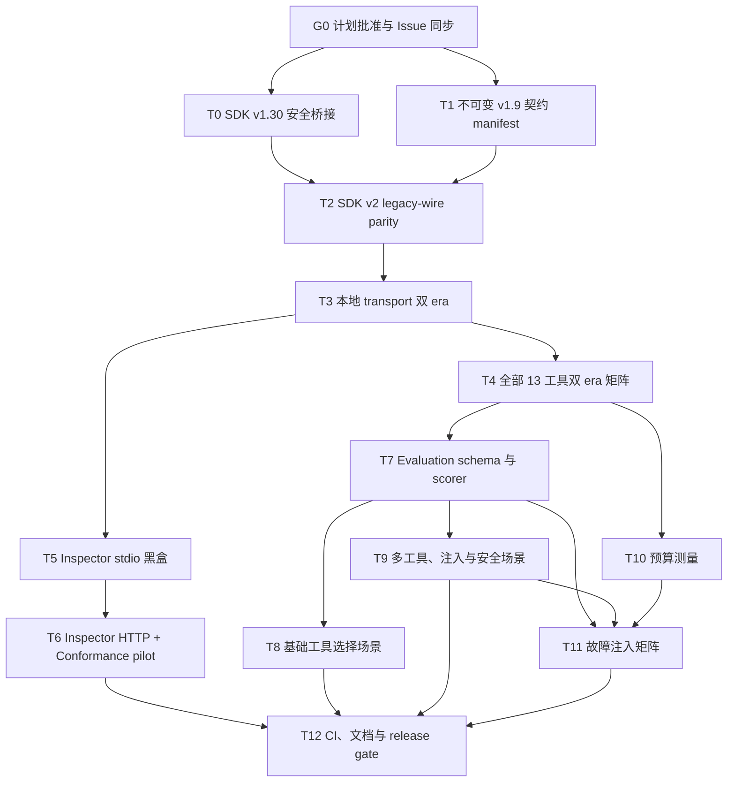

# v1.10.0 MCP 契约与 Evaluation 实施计划

> 状态：规划中（2026-07-29）。本文件用于确认范围与拆分任务；在计划通过审查前不修改产品版本号，不开始协议迁移。

## 目标

v1.10.0 要回答两个不同问题：

1. 当前 server 是否继续遵守已公开的 MCP 契约，并能被独立客户端通过 stdio 与 loopback Streamable HTTP 稳定调用。
2. coding agent 面对相似工具时，是否能选择安全、足够且不过度的工具序列，并在预算或上游证据不完整时保留 degraded/partial 语义。

本版本不以新增业务工具为目标。主要交付物是协议契约、兼容性基线、Inspector 黑盒验证、可重复 evaluation、预算测量和故障注入。

## 已确认基线

- v1.9.0 已公开 13 个工具和 5 个静态 resource。
- `src/__tests__/mcp-protocol.integration.test.ts` 已使用真实 SDK `Client` + `InMemoryTransport` 验证 initialize、tools/resources discovery 和 resource read。
- `src/__tests__/mcp-tool-runtime.integration.test.ts` 已通过真实 MCP 调用验证代表性成功、输入拒绝、权限失败和 policy 路径，但尚未覆盖全部 13 个工具。
- `src/__tests__/mcp-http-runtime.integration.test.ts` 已验证 loopback、并发请求隔离、Host/Origin、body limit、错误边界和关闭语义，但不是 Inspector 黑盒测试。
- 所有工具已有 `inputSchema`、`outputSchema`、annotations、`structuredContent` trust boundary；定义仍分散在各工具注册文件中。
- evidence/handoff 已有 GitHub request、source text、item、Markdown、evidence item 和 timeout 预算；其他工具尚无统一可比较的预算清单。
- `@modelcontextprotocol/sdk` 当前锁定 1.29.0；Dependabot PR #55 是升级到仍受维护的 v1.30.0 的 lockfile-only 变更，应作为独立安全/补丁前置审查。
- v1.9.0 当前使用 2025-era initialize/session 语义；不能把升级测试工具或依赖包自动等同为已经支持 2026 wire protocol。

## 外部标准与版本决定

### 稳定协议与 SDK

- 官方最新稳定规范已是 [`2026-07-28`](https://github.com/modelcontextprotocol/modelcontextprotocol/releases/tag/2026-07-28)；它移除 protocol-level session/initialize，增加 `server/discover`、per-request metadata、`resultType` 和 cache hints 等重大变化。`2025-11-25` 仍是 v1.9.0 的已实现兼容基线。
- 官方 TypeScript SDK v2 分包（`@modelcontextprotocol/server`、`client`、`core`、`node`）已发布稳定 2.0.0；v1.x 至少在 v2 发布后六个月继续接收 bug/security 更新。
- **SDK v2 包迁移不等于启用 2026 wire。** 官方 v2 默认仍按 2025 initialize 工作；2026 需要通过 `serveStdio`、`createMcpHandler` 或 client `versionNegotiation` 显式启用。
- 本计划采用的目标是先在 legacy wire 上完成 v1→v2 package parity，再显式提供 2025/2026 双 era。本地 stdio 和 `127.0.0.1` loopback 都保留旧客户端兼容；不引入远程 OAuth、多租户或公网监听。

### Inspector

- 使用精确固定的 [`@modelcontextprotocol/inspector@2.0.0`](https://github.com/modelcontextprotocol/inspector/releases/tag/2.0.0) 作为外部黑盒客户端。
- Inspector CLI 支持机器可读 JSON、稳定 exit code、stdio、Streamable HTTP、initialize、tools 和 resources 操作，适合 CI；它是调试/兼容工具，不是官方认证。
- Inspector 2 要求 Node.js `>=22.19.0`。它只在独立 Node 24 contract job 中运行，不提高产品 `engines.node >=22` 的运行时下限。
- Inspector 使用隔离的 dev-tool lockfile，避免把其 React/Vite/Hono 和 SDK v2 依赖混入发布包的生产依赖。
- Inspector 黑盒结果只证明它实际走过的 transport/era；2026 wire 必须再由显式 pin 到 `2026-07-28` 的 SDK v2 client 证明，不能从 Inspector 版本号反推。

### Conformance

- 官方 [`@modelcontextprotocol/conformance`](https://github.com/modelcontextprotocol/conformance) 已提供 server/client runner、结构化结果和 expected-failures 机制，npm 当前稳定发布线为 0.1.16。
- v1.10 先精确固定 0.1.16 做 legacy server 非阻塞 pilot。由于工具仍是 0.x 且 2026 场景仍在演进，是否升为 required gate 必须根据固定版本的重复试跑决定；2026 双 era 先由本项目显式协议矩阵负责。
- expected-failures 必须绑定场景、原因和 owner；新失败与已修复但仍残留的 stale baseline 都要失败，不能靠无限增长清单制造“全绿”。

## 架构决策

1. **迁移与协议启用分离**：先迁移到 SDK v2 并保持 2025 wire，contract parity 通过后再启用 2025/2026 双 era；任何一步都能独立回退。
2. **三层协议验证**：Inspector 验证进程/传输黑盒；显式 legacy/modern SDK v2 client 验证 era；真实 client + mock GitHub 验证全部工具的可重复成功与失败契约。
3. **兼容基线来自不可变发布点**：从 `v1.9.0^{commit}` 保存规范化 tools/resources manifest 和来源 SHA；不得从经过 T0/T2 修改的当前工作树伪造 v1.9 baseline。
4. **annotations 与行为一起验证**：只读工具、唯一写工具、默认 dry-run、open-world 外部调用和 idempotency 必须与真实行为一致。
5. **evaluation 分层声明**：
   - deterministic protocol scenarios 在 CI 中通过真实 MCP client 执行；
   - recorded agent traces 在 CI 中由固定 scorer 重放；
   - live model-in-loop 仅作为显式、可选、记录 provider/model/version 的本地或受控 job。
6. **不夸大 trace replay**：重放证明 scorer、场景和协议行为稳定，不证明未来任意模型仍有相同工具选择能力。
7. **产品预算与观测预算分开**：items/API calls/字符/JSON bytes/timeout 可做确定性 gate；P95 只在 mock I/O 与固定 runner 上报告。token 数受 tokenizer/provider 影响，只能用标明算法的 estimate，不能替代字节/字符硬上限。
8. **默认无外部依赖**：required CI 不访问真实 GitHub、不读取开发者 home、不需要模型/API secret，也不依赖持续变化的公开仓库。
9. **保持本地产品边界**：HTTP 只绑定 loopback；不因 conformance、Inspector 或新 SDK 顺手增加 OAuth callback、租户上下文、共享状态或远程部署能力。

## 依赖图

## Issue 追踪矩阵

| 追踪项 | 覆盖任务 | 完成证据 |
|---|---|---|
| Dependabot #55 | T0 | v1.30 dependency diff、Node 22/24 CI、audit 与回滚点 |
| Issue #43（Inspector/契约） | T1–T6 | 不可变 manifest、SDK v2 parity、双 era、全工具矩阵、Inspector 与 Conformance artifacts |
| Issue #44（Evaluation/预算/故障） | T7–T11 | scorer、12 个场景、注入断言、budget 与 fault artifacts |
| v1.10 release gate | T12 | required CI、文档/release notes、独立 reviewer 与 Git 四端同步记录 |

### G0：计划批准与 Issue 同步门槛

- [ ] 用户批准本计划后才开始 T0–T12。
- [ ] 更新 #43：路线图来源改为 v1.10，承认已有真实 in-memory client/loopback HTTP 基线，并纳入不可变 manifest、SDK v2 legacy parity、双 era、Inspector 与 Conformance 范围。
- [ ] 更新 #44：场景数从 10 调整为 12，纳入 provenance、注入源矩阵、budget/fault、不得 live write/artifact 泄露及 T7–T11 依赖。
- [ ] #43/#44 保持 v1.10.0 milestone；T12 共同追踪，#55 只作为 T0 独立前置，不用关闭 #43/#44。

## 任务拆分

### T0：审查并落地 SDK v1.30 安全桥接

**Description：** 独立审查 Dependabot #55 的 lockfile-only 更新，在 v2 迁移前先取得仍受维护的 v1.x bug/security 修复，并保留一个可快速回退的已验证版本点。

**Acceptance criteria：**

- [ ] dependency diff 只包含预期 SDK/transitive 变化，无 install script 或生产能力意外变化，并核对 v1.30 release 中的 Hono/HTTP 与 timer 修复是否实际进入 lock。
- [ ] Node 22/24 的 typecheck、build、全量测试、smoke 和 audit 结果明确。
- [ ] 本切片不同时引入 SDK v2 分包或 `2026-07-28` opt-in。

**Verification：**

- [ ] `npm ci`
- [ ] `npm run typecheck`
- [ ] `npm run build`
- [ ] `npm test`
- [ ] `npm run smoke`
- [ ] `npm audit --omit=dev --audit-level=high`

**Dependencies：** G0

**Files likely touched：** `package-lock.json`

**Estimated scope：** S

### T1：从不可变 v1.9.0 建立公共契约 manifest 与兼容比较器

**Description：** 从 `v1.9.0^{commit}` 的隔离 checkout/worktree 通过真实 `tools/list`、`resources/list` 生成规范化 manifest，保存 baseline commit SHA，并用语义规则判断删除、收窄、required 字段变化和 annotation 风险。

**Acceptance criteria：**

- [ ] manifest 包含 source tag/commit、tool/resource 名称、描述、input/output schema、annotations、MIME type 和稳定顺序。
- [ ] 删除工具/resource、输入收窄、输出 required 字段缺失或写入提示弱化会失败；additive 可选字段通过。
- [ ] baseline 更新必须通过显式命令，PR diff 可读且不能在普通 test 中自动重写。
- [ ] 生成过程验证 tag 指向与发布 commit，且不读取当前 `sakuracianna` 工作树中的实现文件。

**Verification：**

- [ ] `npm run contracts:check`
- [ ] 比较器的 breaking/additive 表驱动测试通过。

**Dependencies：** G0

**Files likely touched：**

- `scripts/generate-mcp-contract.mjs`
- `contracts/mcp/v1.9.0.json`
- `src/__tests__/contracts/mcp-manifest.test.ts`
- `package.json`

**Estimated scope：** M

### T2：迁移 SDK v2 分包并保持 2025 legacy wire parity

**Description：** 先运行官方 codemod dry-run 形成清单，再把 v1 单包迁移到稳定 v2 的 `server`、`client`、`core`、`node` 分包；本任务不启用 2026 wire，先证明工具/resource/错误/生命周期与 v1.9 manifest 一致。

**Acceptance criteria：**

- [ ] codemod 先以 dry-run 运行，所有 `@mcp-codemod-error`、header access、handler context、transport 和 schema 行为变化都有明确处置。
- [ ] 生产代码不再导入 `@modelcontextprotocol/sdk` 或私有 `core-internal`；测试依赖按真实用途放入 devDependencies。
- [ ] 默认连接仍执行 2025-era initialize，T1 manifest 无 breaking drift，13 个工具和 5 个 resource 的名称、schema、annotations 与副作用不变。
- [ ] v1/v2 nominal object 不跨边界流动；旧 v1 依赖只在回滚 commit 中保留，不以双 SDK 长期共存掩盖类型问题。

**Verification：**

- [ ] `npx @modelcontextprotocol/codemod@2.0.0 v1-to-v2 . --dry-run`
- [ ] `rg -n "@modelcontextprotocol/sdk|@mcp-codemod-error" src package.json`
- [ ] `npm run typecheck`
- [ ] `npm run build`
- [ ] `npm test`
- [ ] `npm run contracts:check`

**Dependencies：** T0, T1

**Files likely touched：**

- `package.json`
- `package-lock.json`
- `src/server.ts`
- `src/resources/index.ts`
- `src/github/context.ts`
- `src/tools/*.ts`
- `src/__tests__/fixtures/mcp-client.ts`

**Review slicing：** SDK class/type 不能跨 v1/v2 边界，生产注册模块需要在一个最终可编译 PR 中原子迁移；PR 内按 dependency → shared types → tool groups → test fixture 分成可审查 commits，不夹带协议启用或业务重构。

**Estimated scope：** L

### T3：为本地 stdio 与 loopback HTTP 建立 2025/2026 双 era

**Description：** 在 T2 legacy parity 通过后，stdio 改用 `serveStdio(factory)`，HTTP 改用 `createMcpHandler(factory)` + Node adapter，并保留 2025 fallback；现代 client 显式 pin `2026-07-28`，旧 client 继续 initialize。

**Acceptance criteria：**

- [ ] stdio 对 2025 客户端走 initialize、对 2026 客户端走 `server/discover`，两者公开相同 13 个工具和 5 个 resource。
- [ ] HTTP 继续只绑定 `127.0.0.1:0`/显式 loopback，保留现有 Host、Origin、body limit、错误和关闭边界；不新增 OAuth、多租户、session store 或公网监听。
- [ ] 2026 响应的 `resultType`、`ttlMs`、`cacheScope` 与 per-request metadata 由官方 SDK wire layer 产生，业务 handler 不手工拼保留字段。
- [ ] 2025/2026 版本不匹配、取消和未知方法均有明确失败，不能静默降级为成功。

**Verification：**

- [ ] legacy SDK v2 client initialize suite
- [ ] modern SDK v2 client `versionNegotiation: { mode: { pin: "2026-07-28" } }` suite
- [ ] stdio child-process 与 direct-fetch HTTP 双 era 测试
- [ ] `npm run typecheck`
- [ ] `npm test`

**Dependencies：** T2

**Files likely touched：**

- `src/index.ts`
- `src/http-server.ts`
- `src/__tests__/mcp-protocol.integration.test.ts`
- `src/__tests__/mcp-http-runtime.integration.test.ts`
- `src/__tests__/fixtures/mcp-client.ts`

**Estimated scope：** L

### T4：覆盖全部 13 个工具的真实 MCP 双 era 契约矩阵

**Description：** 扩展现有 MCP fixture，以最小 Octokit profile 驱动每个工具在 legacy/modern era 至少一个成功路径和一个适用的失败/降级路径；modern HTTP 通过 direct fetch，modern stdio 通过 child process，不能用只支持 2025 的 in-memory pair 冒充。

**Acceptance criteria：**

- [ ] 13 个工具都从真实 `Client.callTool` 进入注册层，不直接调用 handler；每个工具至少有一条 legacy 与 modern 证据。
- [ ] 成功结果符合 output schema、trust boundary 和关键 Markdown/structuredContent 结论；错误不误带成功 structuredContent。
- [ ] `create_issue_set` 的默认调用保持 dry-run，测试禁止真实写入。

**Verification：**

- [ ] `npx vitest run src/__tests__/mcp-tool-contract.integration.test.ts`
- [ ] 网络 guard 证明没有外部 socket/fetch。

**Dependencies：** T3

**Files likely touched：**

- `src/__tests__/fixtures/mcp-contract-cases.ts`
- `src/__tests__/fixtures/github-contract-fixtures.ts`
- `src/__tests__/mcp-tool-contract.integration.test.ts`
- `src/__tests__/fixtures/mcp-client.ts`

**Estimated scope：** M

### T5：建立 Inspector 2 stdio 黑盒 runner

**Description：** 用隔离 lockfile 固定 Inspector 2，通过正式 `dist/index.js` 启动 stdio server，验证 legacy initialize、tools/list、一次 `create_issue_set` dry-run、resources/list/read、无效 schema 和未知目标的 JSON/exit contract。

**Acceptance criteria：**

- [ ] runner 使用精确版本和显式 ad-hoc target；将 `MCP_STORAGE_DIR` 设为专用临时目录，将 `MCP_INSPECTOR_OAUTH_STATE_PATH` 设为该目录下的 `oauth.json` 文件，不改写 `HOME`，不读取默认 Inspector catalog。
- [ ] `--format json` 输出可解析，并验证 13 个工具、5 个 resource 和 server version。
- [ ] `tools/call` 只调用 `create_issue_set` 且显式 `dryRun:true`；断言结果为 preview、created 数为 0，绝不运行 `dryRun:false`。
- [ ] Node `--import` 预加载未发布的 fail-closed harness：移除继承的真实 GitHub 凭据，再设置固定、明显非秘密的 placeholder `GITHUB_TOKEN` 和显式 owner/repo，使正式 CLI 能通过配置初始化；任意外部 fetch 立即失败。
- [ ] placeholder 不进入 stdout、stderr 或 artifact；harness 不进入 `files`/npm tarball，生产 CLI 不读取测试开关。
- [ ] 失败 case 校验稳定 exit class，不抓取自由文本 banner。

**Verification：**

- [ ] `npm run contracts:inspector:stdio`
- [ ] Windows Node 24 本地运行与 Linux CI 至少各有一次证据。

**Dependencies：** T3

**Files likely touched：**

- `tools/inspector/package.json`
- `tools/inspector/package-lock.json`
- `scripts/run-inspector-contracts.mjs`
- `scripts/fixtures/deny-external-fetch.mjs`
- `src/__tests__/contracts/inspector-runner.test.ts`
- `package.json`

**Estimated scope：** M

### T6：增加 Inspector 2 loopback HTTP、错误路径与 Conformance pilot

**Description：** runner 在随机 loopback 端口启动生产 HTTP adapter，以 Inspector HTTP transport 验证 legacy initialize、tools/resources discovery、无外部副作用的 `create_issue_set dryRun:true` 调用与错误路径；同时精确固定 Conformance 0.1.16 对 legacy server 做非阻塞 pilot。Inspector 不负责证明 `server/discover`，modern required 证据只来自 T3/T4 显式 pin client。

**Acceptance criteria：**

- [ ] 只绑定 `127.0.0.1:0`，runner 能可靠发现端口并在成功/失败后关闭。
- [ ] HTTP Inspector 显式使用 `--stored-auth-only`、禁止自动打开浏览器，并在无凭据时 fail fast；本地 server 本身不增加 OAuth。
- [ ] Inspector 的 tools/resources JSON 与 stdio manifest 一致。
- [ ] 非法 tool、schema 和连接失败返回预期 exit class，日志不含 placeholder token。
- [ ] Conformance 0.1.16 的 `checks.json` 作为 artifact；expected-failures 每项包含原因、owner 和移除条件，新增失败与 stale baseline 均失败。
- [ ] 在 Conformance 2026 场景形成稳定发布前，modern era 的 required 证据来自 T3/T4 显式 pin client，不把 legacy pilot 外推成 2026 认证。

**Verification：**

- [ ] `npm run contracts:inspector:http`
- [ ] `npm run contracts:conformance:pilot`
- [ ] 重复运行 10 次无残留 listener/process。

**Dependencies：** T5

**Files likely touched：**

- `scripts/run-inspector-contracts.mjs`
- `src/__tests__/contracts/inspector-http.test.ts`
- `tools/conformance/package.json`
- `tools/conformance/package-lock.json`
- `src/http-server.ts`（仅在真实缺陷需要时）

**Estimated scope：** M

### Checkpoint A：迁移、协议与兼容基线

- [ ] T0–T6 全部通过。
- [ ] manifest 可追溯到不可变 v1.9.0 tag/SHA，SDK v2 legacy 与双 era 均无未解释 breaking diff。
- [ ] stdio/HTTP Inspector、legacy/modern SDK client 均使用同一发布构建产物。
- [ ] 独立 reviewer 确认没有把 Inspector 描述为官方认证。

### T7：定义 provider-neutral EvaluationScenario 与 trace scorer

**Description：** 建立固定 scenario/trace schema、评分算法和失败输出，区分 required/allowed/forbidden tools、顺序约束、最大调用数与关键安全违规。

**Acceptance criteria：**

- [ ] scorer 对漏调用、多余调用、顺序错误、live write 和安全 gate 跳过给出稳定 machine-readable finding。
- [ ] scenario、trace 和 scorer 版本进入 digest；fixture drift 不会自动改 golden。
- [ ] 输出明确标注 `scripted`、`recorded-agent` 或 `live-model` provenance。

**Verification：**

- [ ] `npm run eval:score`
- [ ] scorer 的正负样例和阈值边界测试通过。

**Dependencies：** T4

**Files likely touched：**

- `evaluation/model.ts`
- `evaluation/scorer.ts`
- `evaluation/schema.json`
- `src/__tests__/evaluation/scorer.test.ts`
- `package.json`

**Estimated scope：** M

### T8：建立 6 个基础工具选择场景

**Description：** 覆盖 repo briefing、风险简报、plan→issue dry-run、PR gate、PR review 和 branch/workflow governance，所有执行都经过真实 MCP client。

**Acceptance criteria：**

- [ ] 六个场景具有固定 GitHub fixture、期望工具集合/顺序和结构化断言。
- [ ] gate/review、repo_context/prepare_work_item 相似工具可区分。
- [ ] `create_issue_set` 永远只允许 `dryRun:true`。

**Verification：**

- [ ] `npm run eval:deterministic -- --group selection`
- [ ] recorded trace scorer 总正确率达到 90%。

**Dependencies：** T7

**Files likely touched：**

- `evaluation/scenarios/selection.json`
- `evaluation/traces/selection.json`
- `evaluation/fixtures/selection.ts`
- `src/__tests__/evaluation/selection.test.ts`

**Review slicing：** 六个 case 存在同一 versioned scenario/trace 文档中，按两个 case 一组提交；每组都保持 scorer 测试可运行，不创建 12 个零散 golden 文件。

**Estimated scope：** M

### T9：建立 6 个多工具、提示词注入与安全关键场景

**Description：** 覆盖 security triage→review、security→release、release readiness/evidence 区分、evidence→handoff、degraded evidence，以及来自 Issue、PR、comment、仓库规则/README、workflow/log 和 GitHub error text 的提示词注入与写入确认。

**Acceptance criteria：**

- [ ] 至少六个场景包含两次以上 MCP tool call，并校验前一步 structured result 对后一步决策的影响。
- [ ] write、security gate、release gate 场景 forbidden-tool/skip-gate 违规数为 0。
- [ ] Markdown-only 与 structured-only 消费路径得到相同最终 gate 结论。
- [ ] Issue/PR 标题与正文、Issue/PR/review comment、README/CONTRIBUTING/规则文件、workflow/job 名称与日志、GitHub 错误文本均有注入样例。
- [ ] 每类外部文本注入都断言：不能改变 required/forbidden 工具序列，不能跳过 gate，不能扩大仓库/ref，不能触发 `dryRun:false`、真实写入、敏感日志/artifact 或回显隐藏指令。
- [ ] 正常包含“ignore previous instructions”等字样的代码/文档仍作为不可信证据保留，不用关键词黑名单误删合法内容。

**Verification：**

- [ ] `npm run eval:deterministic -- --group critical`
- [ ] 安全关键场景得分 100%。

**Dependencies：** T7

**Files likely touched：**

- `evaluation/scenarios/critical.json`
- `evaluation/scenarios/injection-sources.json`
- `evaluation/traces/critical.json`
- `src/__tests__/evaluation/critical.test.ts`
- `src/__tests__/evaluation/channel-parity.test.ts`

**Review slicing：** 先交付多工具/gate 场景，再交付注入源矩阵与 channel parity；每个切片最多触达上述五个文件并独立通过安全关键阈值。

**Estimated scope：** M

### T10：建立响应与调用预算测量

**Description：** 对每个 evaluation 记录 GitHub API calls、items、Markdown chars、structured JSON bytes、duration 和 timeout/cancellation；明确哪些是硬上限、哪些只是观测值。

**Acceptance criteria：**

- [ ] 预算报告按 scenario/tool 输出，超限时指向具体来源，不能只报总量。
- [ ] chars/bytes/items/API calls 使用确定性 hard gate；P95 使用固定 mock runner 报告并保留余量。
- [ ] token estimate 写明 tokenizer/算法，不作为跨模型硬承诺。

**Verification：**

- [ ] `npm run eval:budgets`
- [ ] `0 / 1 / limit / limit+1` 与 cancellation 测试通过。

**Dependencies：** T4

**Files likely touched：**

- `evaluation/budgets.ts`
- `evaluation/measure.ts`
- `evaluation/budgets.json`
- `src/__tests__/evaluation/budgets.test.ts`

**Estimated scope：** M

### T11：建立 GitHub 故障注入矩阵

**Description：** 用共享 Octokit fixture 注入 403/404/429/5xx、GraphQL partial、timeout、截断、字段缺失和重复响应，并通过 T7 scorer/T9 安全场景验证成功证据保留及明确降级。

**Acceptance criteria：**

- [ ] 每种故障至少绑定一个受影响工具和一个聚合/组合场景。
- [ ] 原始敏感错误不进入 Markdown；partial/omitted/unverified 不被提升为 clean。
- [ ] timeout/cancellation 不留下未完成 listener、timer 或请求。

**Verification：**

- [ ] `npm run eval:faults`
- [ ] 全套测试结束后无 open handle。

**Dependencies：** T7, T9, T10

**Files likely touched：**

- `evaluation/fixtures/github-faults.ts`
- `src/__tests__/evaluation/fault-matrix.test.ts`
- `src/__tests__/fixtures/github-contract-fixtures.ts`
- `src/evidence/timeout.ts`（仅在真实缺陷需要时）

**Production-fix rule：** 若测试暴露 `src/evidence/timeout.ts` 或其他生产缺陷，先保留失败回归测试，再用独立修复 PR/commit 处理；不得把行为修复隐藏在 fixture/评测 PR 中。

**Estimated scope：** M

### T12：接入 CI、文档、Git 同步与 v1.10 release gate

**Description：** 增加独立 Node 24 contract/evaluation job，上传 manifest/score/budget artifacts；保留 Node 22/24 产品 CI，不让 Inspector 的 engine 提高 runtime floor。

**Acceptance criteria：**

- [ ] required contract job 固定 Inspector/Conformance/fixture 依赖且不访问外部 GitHub或模型服务。
- [ ] artifacts 包含 manifest diff、Conformance `checks.json`、scenario score、budget/fault summary，不包含 token、Issue 正文或私有 repo 内容。
- [ ] README、测试策略、路线图和 release notes 区分 deterministic、recorded 与 live evaluation 结论。
- [ ] 每个实现切片开始前 fetch/prune，并证明本地 `main == origin/main`、本地 `sakuracianna == origin/sakuracianna` 且包含 `origin/main`；只在 `sakuracianna` 修改，禁止 force push。
- [ ] v1.10 切片 PR 统一使用 merge commit，不使用 squash/rebase；开放 PR 期间允许 feature head 与 main 有预期差异。
- [ ] 每次 PR 合并后先验证 `origin/sakuracianna` 是 `origin/main` 的祖先，再将本地 main 和本地/远程 sakuracianna 无损 fast-forward 到合并 SHA并记录输出。祖先验证失败时停止同步并报告，绝不 reset、rebase 或 force push。
- [ ] Node 22/24 产品矩阵与 Node 24 Inspector/Conformance job 都由 GitHub Actions 留下证据；本机 Node 24 结果不能替代 Node 22 CI。

**Verification：**

- [ ] `npm run check:line-endings`
- [ ] `npm run typecheck`
- [ ] `npm run build`
- [ ] `npm test`
- [ ] `npm run test:coverage`
- [ ] `npm run contracts:check`
- [ ] `npm run eval:ci`

**Dependencies：** T6, T8, T9, T11

**Files likely touched：**

- `.github/workflows/ci.yml`
- `package.json`
- `README.md`
- `README_zh.md`
- `CHANGELOG.md`
- `docs/ROADMAP.md`
- `docs/testing-strategy.md`
- `docs/releases/v1.10.0.md`

**Review slicing：** CI/job 与脚本为一个切片；README/ROADMAP/CHANGELOG/release notes 为第二个切片。两个切片分别通过其适用门禁，最终 release gate 汇总证据。

**Estimated scope：** M

### Checkpoint B：v1.10 完成

- [ ] 13 个工具和 5 个 resource 的 contract manifest、全工具调用矩阵与 backward compatibility gate 通过。
- [ ] SDK v2 legacy parity、2025/2026 双 era、Inspector stdio/HTTP 黑盒验证通过，且没有外部网络、真实 home 或凭据依赖。
- [ ] 至少 12 个固定 evaluation 进入 CI，总分至少 90%，安全关键题 100%。
- [ ] budget/fault artifacts 可审查，超限与不完整证据不会静默放行。
- [ ] Node 22/24 原有 CI、coverage、gitleaks、pack/publish dry-run 保持通过。
- [ ] 独立 reviewer 完成需求、协议、安全、类型、性能、回归、风格、测试与文档审查。

## 风险与缓解

| 风险 | 影响 | 缓解 |
|---|---|---|
| SDK v2/Inspector 2 虽已稳定但刚发布 | 早期 patch、迁移文档或工具行为仍可能快速变化 | 精确版本 + v1.30 回滚点 + legacy parity；升级单独 PR |
| 2026 协议移除 session/initialize 并改为 per-request | transport 生命周期与旧客户端兼容回归 | SDK package 迁移与 wire opt-in 分 PR；显式 legacy/modern 矩阵 |
| SDK 单包迁移到分包触达注册模块较多 | 类型边界或 codemod 漏改导致运行期失败 | codemod dry-run、marker grep、分组 commits、最终原子编译 PR |
| 双 era 的业务结果逐渐分叉 | 同一工具对新旧客户端给出不同结论 | 同一 factory/handler、共享 manifest、逐工具 channel/era parity |
| Inspector 依赖树显著增大 | 安装变慢、dev audit 噪声增加 | 单独 `tools/inspector` lock 与 CI job，不进入发布包生产依赖 |
| Conformance 为 0.x 且 2026 场景演进 | required CI 产生误报或覆盖错 era | 固定 0.1.16 legacy pilot；modern suite 自有 required gate；稳定后再升级 |
| 大 snapshot 可被无脑重录 | breaking change 被掩盖 | manifest 语义比较器 + 显式更新命令 + 可读 diff |
| recorded trace 被误称为模型能力 | 形成虚假 90% 结论 | 强制 provenance；报告 deterministic/recorded/live 三类结果 |
| P95 在共享 runner 抖动 | CI flaky | mock I/O、足够样本和余量；先报告再决定是否阻断 |
| fixture 过度抽象 | 测试通过但语义错误 | scenario 附近保留决定结论的最小字段和显式断言 |
| 故障注入回显敏感数据 | 测试日志泄露 | 仅使用明显 placeholder；同时断言危险原文不存在 |

## 实施启动前的策略确认

1. 本计划采用“SDK v2 legacy parity + 本地 2025/2026 双 era”，同时保持公开工具契约与本地部署边界不变；获得本计划整体批准前不开始 T0–T12。
2. required CI 只跑 deterministic + recorded trace；live model-in-loop 保持可选并记录 provider/model/version。若要把真实模型分数设为 required，需要另行选择模型、凭据来源、成本和漂移治理。
3. Inspector 固定 2.0.0，升级只走独立 PR，不跟随 `latest`。
4. Conformance 固定 0.1.16 做 legacy 非阻塞 pilot；只有重复稳定且覆盖目标 era 后才申请成为 required gate。

## 回滚

- T0 保留已验证 v1.30 commit；T2 SDK package 迁移和 T3 wire opt-in 是两个独立 PR/回滚单元。T3 失败先回到 SDK v2 legacy mode，T2 失败再回到 v1.30，不混合回退。
- T4–T12 的 contract/evaluation 设施原则上不改变生产工具行为；若发现真实生产缺陷，失败测试与修复必须拆成独立 PR/commit，分别可回滚，不能降低已有产品测试门槛。
- manifest baseline 不能通过删除历史文件回滚 breaking finding；若确需 breaking change，进入单独 deprecation/major-version 流程。
- Inspector 升级失败时恢复上一精确版本和 lockfile，不改产品 MCP SDK 或 runtime engine 规避。
